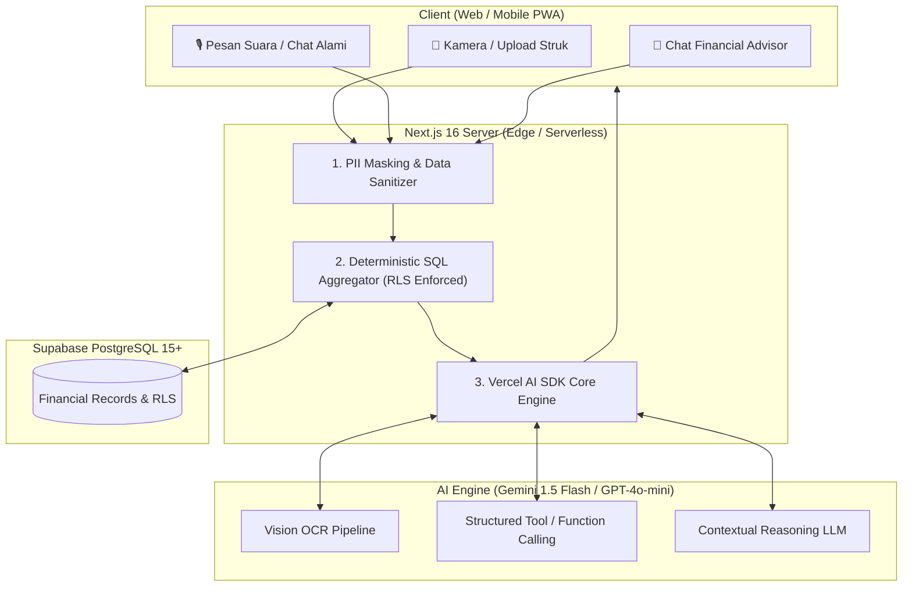

# 🤖 AI Financial Assistant & Vision OCR Architecture Specification
## My Finance — Intelligent Family Financial Companion

---

## 1. Executive Summary & AI Philosophy

Modul **My Finance AI** dirancang sebagai asisten keuangan keluarga cerdas yang berfokus pada dua pilar utama:
1. **Zero-Friction Logging**: Mengeliminasi beban pencatatan manual melalui **Smart Receipt Vision OCR** dan **Natural Language / Voice Transaction Input**.
2. **Contextual Actionable Intelligence**: Memberikan analisis, peringatan dini (*budget burn-rate alert*), dan jawaban strategis terhadap kondisi finansial keluarga secara personal, terisolasi, dan aman.

### Prinsip Utama Desain AI:
- **Deterministic Math over LLM Hallucination**: AI **tidak diperbolehkan** menghitung penjumlahan saldo atau sisa anggaran secara mandiri. Seluruh kalkulasi angka dasar dieksekusi secara pasti oleh PostgreSQL / Supabase, kemudian hasil agregat diumpankan (*grounding*) ke LLM sebagai konteks fakta.
- **Privacy & PII Protection**: Data sensitif (nomor rekening asli, data kontak) disamarkan (*masked*) sebelum dikirim ke API model AI.
- **Cost-Effective & High Performance**: Menggunakan model *fast vision/reasoning* efisien (**Google Gemini 1.5 Flash** / **OpenAI GPT-4o-mini**) dengan waktu respon `< 1.5 detik` dan biaya `< $0.001` per transaksi.

---

## 2. AI Architecture & Data Flow



---

## 3. Spesifikasi Modul Fitur AI

---

### 3.1 📸 Smart Receipt OCR Scanner
Mengekstrak informasi transaksi secara terstruktur dari foto struk belanja, nota restoran, atau invoice tagihan.

* **Endpoint**: `POST /api/ai/scan-receipt`
* **Input**: `multipart/form-data` (Gambar JPG/PNG/WEBP, maksimal 5MB)
* **Zod Output Schema**:
```typescript
import { z } from 'zod';

export const ScannedReceiptSchema = z.object({
  merchantName: z.string().describe("Nama toko atau penyedia jasa"),
  transactionDate: z.string().regex(/^\d{4}-\d{2}-\d{2}$/).describe("Format YYYY-MM-DD"),
  totalAmount: z.number().positive().describe("Total nominal pembayaran akhir"),
  suggestedCategoryId: z.string().uuid().nullable().describe("ID kategori yang paling cocok dari daftar kategori keluarga"),
  suggestedCategoryName: z.string().describe("Nama kategori yang direkomendasikan"),
  confidenceScore: z.number().min(0).max(1),
  items: z.array(
    z.object({
      name: z.string(),
      qty: z.number().default(1),
      price: z.number()
    })
  ).optional().describe("Rincian belanja jika terbaca jelas"),
  paymentMethodDetected: z.enum(["cash", "bank_transfer", "qris_ewallet", "credit_card", "unknown"]).default("unknown")
});
```

* **System Prompt Template (Vision OCR)**:
```text
Anda adalah OCR Financial Intelligence Engine untuk aplikasi My Finance.
Tugas Anda adalah membaca gambar struk belanja dan mengembalikan data JSON terstruktur sesuai skema berikut.

Kategori yang tersedia pada keluarga pengguna:
{{AVAILABLE_CATEGORIES_JSON}}

Daftar Dompet yang tersedia:
{{AVAILABLE_WALLETS_JSON}}

Aturan:
1. Ekstrak nama merchant, tanggal transaksi (konversi ke YYYY-MM-DD), dan total nominal akhir.
2. Cocokkan item belanja dengan kategori keluarga yang paling relevan. Jika tidak ada yang cocok, gunakan kategori 'Lainnya'.
3. Deteksi metode pembayaran dari teks struk (misal 'QRIS', 'BCA DEBIT', 'TUNAI').
4. Keluarkan HANYA format JSON valid tanpa teks pengantar atau markdown tambahan.
```

---

### 3.2 💬 Natural Language & Voice Transaction Parser
Memungkinkan anggota keluarga mencatat pengeluaran melalui teks percakapan biasa atau transkripsi rekaman suara.

* **Endpoint**: `POST /api/ai/parse-transaction`
* **Contoh Input Teks**:
  * *"Tadi isi bensin motor 45 ribu bayar pakai GoPay"*
  * *"Dapat bonus freelance desain 2.500.000 masuk ke BCA"*
  * *"Transfer uang belanja 1 juta dari BCA ke Mandiri Sarah"*

* **LLM Tool / Function Calling Definition**:
```typescript
export const createTransactionTool = {
  name: "record_financial_transaction",
  description: "Mencatat transaksi pemasukan, pengeluaran, atau transfer keluarga",
  parameters: {
    type: "object",
    properties: {
      type: { type: "string", enum: ["income", "expense", "transfer"] },
      amount: { type: "number", description: "Nominal uang dalam rupiah" },
      walletName: { type: "string", description: "Nama dompet yang digunakan" },
      toWalletName: { type: "string", description: "Nama dompet tujuan (khusus transfer)" },
      categoryName: { type: "string", description: "Nama kategori transaksi" },
      description: { type: "string", description: "Catatan atau keterangan transaksi" },
      transactionDate: { type: "string", description: "Tanggal transaksi (default: hari ini)" }
    },
    required: ["type", "amount", "description"]
  }
};
```

---

### 3.3 💬 Interactive Family Financial Advisor (Chat Streaming)
Asisten interaktif yang menjawab pertanyaan finansial keluarga berdasarkan fakta data historis.

* **Endpoint**: `POST /api/ai/advisor-chat`
* **Streaming Protocol**: Server-Sent Events (SSE) via Vercel AI SDK (`useChat`).
* **Injeksi Konteks Data (Grounding Snapshot)**:
```json
{
  "family": { "name": "Keluarga Adjie", "currency": "IDR" },
  "financialSnapshot": {
    "currentTotalBalance": 45800000,
    "currentMonthIncome": 18500000,
    "currentMonthExpense": 9200000,
    "netCashFlow": 9300000,
    "savingsRate": "50.2%",
    "topExpenseCategories": [
      { "category": "Kebutuhan Dapur", "amount": 3200000, "budgetLimit": 3500000 },
      { "category": "Cicilan Kendaraan", "amount": 1800000, "budgetLimit": 1800000 },
      { "category": "Makan Luar & Kopi", "amount": 1450000, "budgetLimit": 1000000 }
    ],
    "goals": [
      { "name": "Dana Darurat", "target": 30000000, "collected": 18500000, "progress": "61.6%" }
    ]
  }
}
```

* **System Guardrails & Anti-Hallucination Directives**:
```text
Anda adalah "My Finance AI Advisor", perencana keuangan keluarga yang ramah, objektif, dan mendukung.
Anda berbicara kepada pasangan suami-istri yang mengelola keuangan bersama.

Aturan Wajib:
1. Jawab HANYA berdasarkan angka yang terdapat pada data konteks 'financialSnapshot'.
2. JANGAN PERNAH mengarang data saldo, pengeluaran, atau pendapatan yang tidak ada dalam konteks.
3. Berikan saran yang praktis, realistis, dan memotivasi tanpa menggurui.
4. Jika ditanya mengenai keputusan finansial berisiko tinggi (misal investasi spekulatif atau utang besar), ingatkan pengguna untuk mempertimbangkan rasio dana darurat keluarga.
5. Selalu gunakan format mata uang Rupiah Indonesia (contoh: Rp 1.500.000).
```

---

### 3.4 ⚠️ Predictive Anomaly & Budget Burn-Rate Alert
Engine analitik otomatis yang mengevaluasi laju pengeluaran keluarga dan memicu notifikasi peringatan dini.

* **Formula Burn-Rate**:
$$\text{Laju Harian} = \frac{\text{Realisasi Pengeluaran}}{\text{Hari Berjalan}}$$
$$\text{Proyeksi Akhir Bulan} = \text{Laju Harian} \times \text{Total Hari Bulan Ini}$$
* Jika $\text{Proyeksi Akhir Bulan} > \text{Batas Anggaran}$, sistem membuat ringkasan peringatan:
  > *"⚠️ Peringatan Anggaran: Pengeluaran 'Makan Luar & Hiburan' telah mencapai Rp 850.000 di hari ke-12. Dengan laju saat ini, diproyeksikan akan melebihi anggaran sebesar Rp 600.000 di akhir bulan. Disarankan mengurangi frekuensi makan di luar untuk sisa bulan ini."*

---

### 3.5 📰 Monthly Family Financial Digest Generator
Membuat laporan naratif bulanan yang merayakan pencapaian tabungan dan memberikan evaluasi konstruktif bagi keluarga.

* **Trigger**: Vercel Cron / Supabase Scheduled Function pada hari ke-1 setiap bulan baru.
* **Output**: Disimpan ke tabel `notifications` dan ditampilkan sebagai kartu sambutan di Dashboard.

---

### 3.6 📸 Batch / Multi-Receipt Upload OCR Pipeline
Memungkinkan pengguna mengunggah 2 hingga 5 foto nota belanja sekaligus untuk diekstrak secara paralel oleh Gemini 1.5 Flash Vision.

* **Pipeline Flow**:
  1. Kompresi gambar batch di sisi browser (Web Worker / Canvas resizing max 1200px).
  2. Eksekusi paralel `Promise.allSettled()` menuju endpoint Vision OCR.
  3. Validasi skema Zod dan penyusunan draft transaksi berurutan di modal review (*Multi-Receipt Queue Drawer*).
  4. Pengguna dapat melakukan koreksi massal dengan satu tombol "Simpan Semua Transaksi".

---

### 3.7 🏷️ Real-Time Contextual Auto-Categorization Predictor
Model klasifikasi cepat yang memprediksi kategori transaksi secara instan saat pengguna mengetik deskripsi.

* **Endpoint**: Server Action `predictCategoryWithAIAction(description, categories)`
* **Latency Target**: `< 300 ms` dengan *debounced typing* (300ms delay setelah ketikan berhenti).
* **Mekanisme**: Membandingkan deskripsi teks (misal: *"Beli pertalite di pom bensin"*) dengan daftar kategori aktif keluarga, lalu mengembalikan `categoryId` dengan confidence score > 0.85 untuk auto-select dropdown otomatis.

---

### 3.8 📈 Weekly AI Financial Trends & Actionable Savings Insights
Menganalisis fluktuasi arus kas 7 hari terakhir dibandingkan minggu sebelumnya.

* **Output Contoh**:
  > *"📊 Wawasan Mingguan: Pengeluaran kategori 'Jajan & Kopi' minggu ini naik 35% (Rp 420.000 vs Rp 310.000). Anda berpotensi menghemat hingga Rp 150.000 minggu depan jika menyeduh kopi sendiri di rumah."*
* Ditampilkan di dashboard utama dan tab Advisor sebagai rekomendasi proaktif.

---

### 3.9 ⏰ One-Click Bill & Debt Due Reminders Template Generator
Menghasilkan pesan pengingat jatuh tempo tagihan atau piutang yang sopan dan siap dikirim via WhatsApp Link (`https://wa.me/?text=...`) atau Email.

* **Template WhatsApp Dinamis**:
  > *"Halo [Nama], sekadar mengingatkan ramah mengenai cicilan/piutang sebesar [Rp Nominal] yang akan jatuh tempo pada tanggal [Tanggal Jatuh Tempo]. Terima kasih banyak ya! 🙏"*

---

## 4. Keamanan, Privasi & Kepatuhan AI

1. **Zero Data Retention for Training**: Menggunakan API berbayar tingkat enterprise (Enterprise Tier) yang menjamin data pengguna **tidak akan digunakan** untuk melatih model (*model training*).
2. **Kompilasi Prompt Terisolasi (RLS Safe)**: Context injector hanya mengeksekusi query database dengan parameter `family_id` yang telah divalidasi oleh sesi login pengguna.
3. **Penghapusan File Sementara**: Gambar struk yang diunggah untuk pemrosesan OCR langsung dihapus dari memori server setelah payload JSON terbentuk, atau disimpan di bucket privat Supabase jika pengguna menghendaki lampiran struk disimpan.

---

## 5. Estimasi Biaya & Optimasi Performa AI

| Fitur | Model AI Rekomendasi | Estimasi Latensi | Estimasi Biaya per 1.000 Panggilan |
|---|---|---|---|
| **Scan Struk OCR Single** | Google Gemini 1.5 Flash (Vision) | ~1.1 detik | **$0.25** (~Rp 4.000,-) |
| **Batch Multi-Receipt (3-5 struk)** | Gemini 1.5 Flash (Parallel) | ~1.8 detik | **$0.75** (~Rp 12.000,-) |
| **Auto-Category Predictor** | Gemini Flash / Fast Embedding | ~0.3 detik | **$0.05** (~Rp 800,-) |
| **Weekly AI Digest** | Gemini 1.5 Flash | Batch Job | **$0.05** (~Rp 800,-) |
| **Advisor Chat (Streaming)** | Gemini 1.5 Flash / GPT-4o-mini | Real-time (TTFT < 400ms) | **$0.30** (~Rp 4.800,-) |

