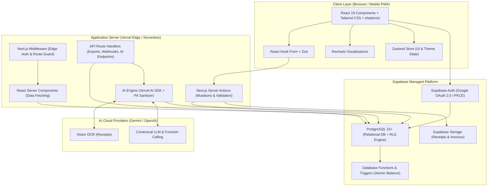

# 🏛️ System Architecture & Engineering Design
## My Finance — Technical Blueprint

---

## 1. High-Level Architecture Overview

**My Finance** dibangun menggunakan arsitektur monolitik modular (*Modular Monolith*) modern dengan **Next.js 16 (App Router)** di lapisan frontend & server logic, serta **Supabase Platform** di lapisan backend, database relasional, otentikasi, dan file storage.



---

## 2. Layered Responsibilities & Data Flow

### 2.1 Presentation & Client Layer
- **Component-Driven Architecture**: Menggunakan komponen modular shadcn/ui (berbasis Radix UI) yang dapat diakses penuh (*accessible*).
- **Client State vs Server State**:
  - *Server State*: Seluruh data finansial di-fetch langsung di Server Components dan di-revalidate melalui `revalidatePath()` / `revalidateTag()`.
  - *Client State*: Hanya untuk state UI murni (tema dark/light, state drawer/modal, active tab) menggunakan **Zustand**.

### 2.2 Server Actions & AI Layer (Business Logic)
- Seluruh mutasi data (tambah transaksi, ubah anggaran, alokasi tabungan) dijalankan via Next.js Server Actions yang aman:
  1. Verifikasi sesi otentikasi pengguna.
  2. Resolusi context workspace keluarga (`family_id`).
  3. Validasi skema input dengan **Zod**.
  4. Pengecekan otorisasi peran (*RBAC*).
  5. Eksekusi query database via Supabase Client dengan RLS aktif.
  6. Pencatatan audit log ke `activity_logs`.
  7. Revalidasi cache halaman terkait.
- **AI Processing Subsystem**:
  - *Smart Receipt OCR*: Pipeline Vision AI mengekstrak data struk menjadi JSON terstruktur.
  - *Deterministic Grounding*: AI Advisor hanya menganalisis hasil query agregat PostgreSQL yang sudah dihitung pasti (bebas halusinasi).
  - *PII Sanitizer*: Menyamarkan nomor kontak dan rekening sebelum dikirim ke API model AI.

### 2.3 Database & Storage Layer (Supabase)
- **PostgreSQL 15+ Engine**: Menyimpan seluruh data relasional secara terstruktur dengan constraint integritas referensial.
- **Row Level Security (RLS)**: Menjamin tidak ada celah pembacaan atau manipulasi data antar-keluarga.
- **Automated Triggers**: Menjaga integritas saldo mutasi wallet dan akumulasi progres target finansial secara atomik.
- **Encrypted File Storage**: Bucket `receipts` dilindungi RLS per folder `family_id`.

---

## 3. Directory Layout & Feature Modules

Arsitektur kode diorganisasikan berbasis domain fitur (*Feature-Driven Folder Structure*):

```
my_finance/
├── app/                        # Next.js App Router (Routing & Pages)
│   ├── (auth)/                 # Login & Callback routes
│   ├── (dashboard)/            # Authenticated App Workspace
│   │   ├── dashboard/          # Executive Dashboard
│   │   ├── wallets/            # Multi-wallet management
│   │   ├── transactions/       # Income, Expense, Transfer ledger
│   │   ├── budgeting/          # Monthly budget planning
│   │   ├── goals/              # Financial savings targets
│   │   ├── reports/            # Analytics & Export
│   │   ├── family/             # Member & Role management
│   │   ├── settings/           # Personal preferences
│   │   └── onboarding/         # Setup wizard
│   └── api/                    # Streaming file exports, webhooks, & AI endpoints
├── components/                 # Reusable UI Primitives
├── features/                   # Domain Modules (Actions, Components, Hooks per Feature)
│   ├── ai/                     # Vision OCR, Voice/Natural Language parser, Advisor Chat
│   ├── auth/                   # Session, OAuth, Role guards
│   ├── transactions/           # Transaction ledger, quick add modal
│   └── ...
├── lib/                        # Supabase clients, AI SDK instances, formatters
├── schemas/                    # Zod validation schemas
├── types/                      # TypeScript database and business types
├── tests/                      # Automated QA Testing Framework
│   ├── unit/                   # Vitest unit tests
│   ├── integration/            # Server actions & DB tests
│   ├── e2e/                    # Playwright multi-device tests
│   └── database/               # pgTAP RLS security tests
└── supabase/                   # Migrations, seed SQL, and RLS policies
```

---

## 4. Key Architectural Patterns

1. **Defense in Depth**: Keamanan 3 lapis (Client Validation -> Server Action Auth Check -> PostgreSQL Database RLS).
2. **Atomic Ledger Pattern**: Saldo dompet tidak diubah secara manual di frontend, melainkan dihitung otomatis oleh trigger database pada setiap penambahan, modifikasi, atau penghapusan transaksi.
3. **Idempotent Operations**: Mencegah duplikasi submit transaksi menggunakan Server Actions dengan status pending form submission (`useActionState` / `useFormStatus`).
4. **Automated Quality Gates**: Mengharuskan 100% test pass rate dan minimal 80% coverage sebelum promosi kode ke lingkungan produksi.
