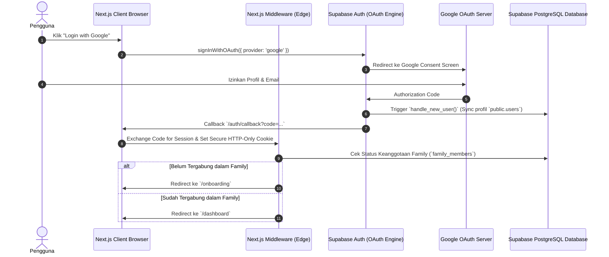

# 🔑 Authentication & Role-Based Access Control (RBAC)
## My Finance — Security Architecture

---

## 1. Overview & Authentication Flow

Aplikasi **My Finance** menggunakan sistem otentikasi terpusat yang aman berbasis **Supabase Auth** terintegrasi dengan **Google OAuth (OpenID Connect)**. Pengelolaan sesi menggunakan **Next.js SSR cookies** dengan library `@supabase/ssr`.



---

## 2. Role-Based Access Control (RBAC) Matrix

Setiap anggota keluarga dalam workspace memiliki salah satu dari tiga peran:

1. **Owner (Kepala Workspace)**: Memiliki hak mutlak terhadap seluruh data, manajemen anggota, pengaturan keluarga, dan penghapusan workspace.
2. **Admin**: Memiliki hak mengelola seluruh aspek operasional finansial (transaksi, budget, target, rekening) dan mengundang anggota baru.
3. **Member**: Memiliki hak mencatat transaksi harian, melihat dashboard, dan memantau progres tabungan tanpa izin mengubah konfigurasi sistem.

### Matriks Izin (Permission Matrix):

| Modul / Tindakan | Owner | Admin | Member |
|---|:---:|:---:|:---:|
| **Lihat Dashboard & Ringkasan Saldo** | ✅ | ✅ | ✅ |
| **Tambah Transaksi (Income / Expense / Transfer)** | ✅ | ✅ | ✅ |
| **Edit / Hapus Transaksi Pribadi** | ✅ | ✅ | ✅ |
| **Edit / Hapus Transaksi Anggota Lain** | ✅ | ✅ | ❌ |
| **Upload / Hapus Lampiran Bukti Struk** | ✅ | ✅ | ✅ (Struk Sendiri) |
| **Lihat Daftar Dompet / Rekening** | ✅ | ✅ | ✅ |
| **Tambah / Edit Rekening Dompet** | ✅ | ✅ | ❌ |
| **Arsipkan Rekening Dompet** | ✅ | ❌ | ❌ |
| **Buat / Edit Anggaran (*Budget*)** | ✅ | ✅ | ❌ |
| **Buat / Edit Target Tabungan (*Goals*)** | ✅ | ✅ | ❌ |
| **Setor Alokasi Dana Tabungan (*Goal Contribution*)** | ✅ | ✅ | ✅ |
| **Lihat & Ekspor Laporan (PDF, Excel, CSV)** | ✅ | ✅ | ✅ |
| **Undang Anggota Keluarga (*Invite Member*)** | ✅ | ✅ | ❌ |
| **Ubah Peran Anggota (*Change Role*)** | ✅ | ❌ | ❌ |
| **Keluarkan Anggota (*Remove Member*)** | ✅ | ❌ | ❌ |
| **Ubah Profil Pribadi (Bahasa, Tema, Nama)** | ✅ | ✅ | ✅ |
| **Ubah Nama / Mata Uang Keluarga** | ✅ | ❌ | ❌ |
| **Hapus Workspace Keluarga (*Danger Zone*)** | ✅ | ❌ | ❌ |

---

## 3. Next.js 16 Middleware & Route Protection

Middleware Next.js mengecek sesi otentikasi di Edge runtime sebelum halaman di-render:

```typescript
// middleware.ts
import { createServerClient } from '@supabase/ssr'
import { NextResponse, type NextRequest } from 'next/server'

export async function middleware(request: NextRequest) {
  let response = NextResponse.next({
    request: { headers: request.headers },
  })

  const supabase = createServerClient(
    process.env.NEXT_PUBLIC_SUPABASE_URL!,
    process.env.NEXT_PUBLIC_SUPABASE_ANON_KEY!,
    {
      cookies: {
        getAll() {
          return request.cookies.getAll()
        },
        setAll(cookiesToSet) {
          cookiesToSet.forEach(({ name, value, options }) => response.cookies.set(name, value, options))
        },
      },
    }
  )

  const { data: { user } } = await supabase.auth.getUser()
  const { pathname } = request.nextUrl

  // 1. Rute Publik
  if (pathname === '/login' || pathname.startsWith('/auth/')) {
    if (user) {
      return NextResponse.redirect(new URL('/dashboard', request.url))
    }
    return response
  }

  // 2. Rute Terlindungi (Protected Routes)
  const isProtected = ['/dashboard', '/wallets', '/transactions', '/budgeting', '/goals', '/reports', '/family', '/settings', '/onboarding'].some(route => pathname.startsWith(route))

  if (isProtected && !user) {
    return NextResponse.redirect(new URL('/login', request.url))
  }

  return response
}

export const config = {
  matcher: ['/((?!_next/static|_next/image|favicon.ico|.*\\.(?:svg|png|jpg|jpeg|gif|webp)$).*)'],
}
```

---

## 4. Multi-Tenant Workspace Resolution

Untuk memastikan operasi data selalu terisolasi pada keluarga yang tepat:

1. Pada saat server rendering atau eksekusi Server Actions, sistem mengambil `user.id`.
2. Melakukan lookup ke tabel `family_members` untuk mendapatkan `family_id` dan `role` aktif:
   ```typescript
   export async function getCurrentUserFamilyContext() {
     const supabase = await createClient()
     const { data: { user }, error: authError } = await supabase.auth.getUser()
     
     if (authError || !user) throw new Error("UNAUTHORIZED")

     const { data: member, error: memberError } = await supabase
       .from('family_members')
       .select('family_id, role, is_active, families(*)')
       .eq('user_id', user.id)
       .eq('is_active', true)
       .single()

     if (memberError || !member) {
       return { user, familyId: null, role: null }
     }

     return {
       user,
       familyId: member.family_id,
       role: member.role,
       family: member.families
     }
   }
   ```
3. Jika `familyId` bernilai `null`, pengguna otomatis diarahkan ke alur Onboarding untuk membuat atau bergabung ke keluarga.

---

## 5. Security & Session Best Practices

- **PKCE (Proof Key for Code Exchange)** diaktifkan secara default untuk mencegah serangan *authorization code interception*.
- **HTTP-Only, Secure, SameSite=Lax Cookies** untuk mencegah pencurian token melalui serangan *Cross-Site Scripting (XSS)*.
- **Refresh Token Rotation**: Supabase secara otomatis merotasi refresh token setiap kali token akses baru diterbitkan.
- **Strict Logout Cleanup**: Saat logout, seluruh cookie sesi dihapus dan sesi dibatalkan pada server auth Supabase.
