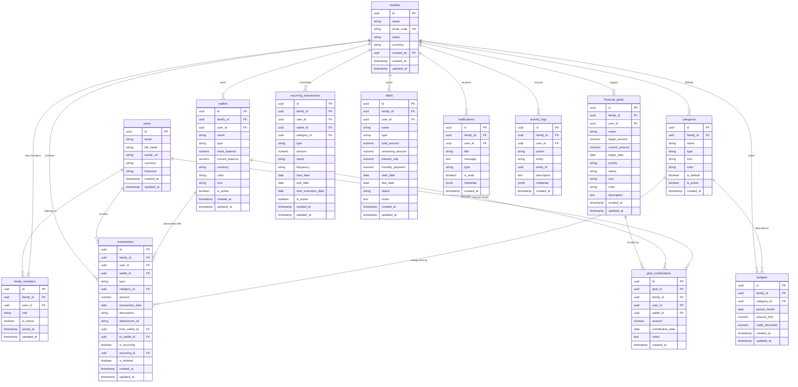

# 🗄️ Database Architecture & Schema Specification
## My Finance — Supabase PostgreSQL 15+

---

## 1. Overview & Database Philosophy

Aplikasi **My Finance** menggunakan **PostgreSQL 15+** yang di-host di atas platform **Supabase**. Database ini dirancang dengan prinsip:

1. **Multi-Tenant Isolation**: Setiap baris data krusial memiliki relasi langsung ke `family_id` dan dilindungi oleh **Row Level Security (RLS)**.
2. **Financial Data Integrity**: Perhitungan saldo, relasi transfer, dan alokasi dana tabungan dijaga dengan *ACID transactions*, *database constraints*, dan *triggers*.
3. **Auditability**: Seluruh mutasi transaksi dan perubahan konfigurasi dicatat dalam tabel `activity_logs`.
4. **Performance Optimized**: Penggunaan indeks komposit (*composite indexes*) pada kolom filter utama seperti `(family_id, transaction_date)` dan `(family_id, period_month)`.

---

## 2. Entity Relationship Diagram (ERD)



---

## 3. Data Dictionary & Table Definitions

### 3.1 `users`
Menyimpan profil pengguna yang tersinkronisasi langsung dari `auth.users` Supabase via Trigger.

| Kolom | Tipe Data | Constraint | Deskripsi |
|---|---|---|---|
| `id` | `UUID` | `PRIMARY KEY, REFERENCES auth.users(id) ON DELETE CASCADE` | ID identitas pengguna |
| `email` | `TEXT` | `NOT NULL, UNIQUE` | Alamat email terdaftar |
| `full_name` | `TEXT` | `NOT NULL` | Nama lengkap pengguna |
| `avatar_url` | `TEXT` | `NULL` | URL foto profil dari Google OAuth |
| `phone` | `TEXT` | `NULL` | Nomor telepon |
| `currency` | `VARCHAR(3)` | `DEFAULT 'IDR'` | Kode mata uang default |
| `timezone` | `TEXT` | `DEFAULT 'Asia/Jakarta'` | Zona waktu pengguna |
| `created_at` | `TIMESTAMPTZ` | `DEFAULT NOW()` | Waktu pendaftaran |
| `updated_at` | `TIMESTAMPTZ` | `DEFAULT NOW()` | Waktu pembaruan profil |

---

### 3.2 `families`
Mewakili ruang kerja (*workspace*) keluarga yang menaungi seluruh data finansial bersama.

| Kolom | Tipe Data | Constraint | Deskripsi |
|---|---|---|---|
| `id` | `UUID` | `PRIMARY KEY DEFAULT gen_random_uuid()` | ID unik workspace keluarga |
| `name` | `TEXT` | `NOT NULL` | Nama keluarga (misal: "Keluarga Adjie") |
| `invite_code` | `VARCHAR(16)` | `NOT NULL, UNIQUE` | Kode unik untuk bergabung ke family |
| `status` | `VARCHAR(20)` | `DEFAULT 'active' CHECK (status IN ('active', 'inactive'))` | Status aktif keluarga |
| `currency` | `VARCHAR(3)` | `DEFAULT 'IDR'` | Mata uang basis workspace |
| `created_by` | `UUID` | `REFERENCES users(id) ON DELETE SET NULL` | ID inisiator keluarga |
| `created_at` | `TIMESTAMPTZ` | `DEFAULT NOW()` | Waktu pembuatan |
| `updated_at` | `TIMESTAMPTZ` | `DEFAULT NOW()` | Waktu pembaruan |

---

### 3.3 `family_members`
Menghubungkan user dengan workspace keluarga dan mendefinisikan peran hak akses (*RBAC*).

| Kolom | Tipe Data | Constraint | Deskripsi |
|---|---|---|---|
| `id` | `UUID` | `PRIMARY KEY DEFAULT gen_random_uuid()` | ID unik relasi member |
| `family_id` | `UUID` | `NOT NULL REFERENCES families(id) ON DELETE CASCADE` | ID keluarga |
| `user_id` | `UUID` | `NOT NULL REFERENCES users(id) ON DELETE CASCADE` | ID pengguna |
| `role` | `VARCHAR(20)` | `NOT NULL CHECK (role IN ('owner', 'admin', 'member'))` | Tingkat hak akses |
| `is_active` | `BOOLEAN` | `DEFAULT true` | Status keaktifan member |
| `joined_at` | `TIMESTAMPTZ` | `DEFAULT NOW()` | Tanggal bergabung |
| `updated_at` | `TIMESTAMPTZ` | `DEFAULT NOW()` | Tanggal update role |
| **Constraint** | `UNIQUE` | `(family_id, user_id)` | Satu user hanya 1 status di 1 family |

---

### 3.4 `wallets`
Menyimpan akun/dompet penyimpan dana keluarga.

| Kolom | Tipe Data | Constraint | Deskripsi |
|---|---|---|---|
| `id` | `UUID` | `PRIMARY KEY DEFAULT gen_random_uuid()` | ID unik dompet |
| `family_id` | `UUID` | `NOT NULL REFERENCES families(id) ON DELETE CASCADE` | Relasi ke keluarga |
| `user_id` | `UUID` | `REFERENCES users(id) ON DELETE SET NULL` | Penanggung jawab dompet |
| `name` | `TEXT` | `NOT NULL` | Nama dompet (misal: "BCA Tabungan", "Kas Tunai") |
| `type` | `VARCHAR(20)` | `NOT NULL CHECK (type IN ('cash', 'bank', 'ewallet', 'credit_card', 'investment', 'other'))` | Tipe akun |
| `initial_balance`| `NUMERIC(15,2)` | `DEFAULT 0.00 NOT NULL` | Saldo awal pembukaan akun |
| `current_balance`| `NUMERIC(15,2)` | `DEFAULT 0.00 NOT NULL` | Saldo saat ini (dihitung/diupdate via trigger) |
| `currency` | `VARCHAR(3)` | `DEFAULT 'IDR'` | Mata uang |
| `color` | `VARCHAR(10)` | `DEFAULT '#10B981'` | Kode warna hex untuk UI |
| `icon` | `TEXT` | `DEFAULT 'wallet'` | Ikon Lucide React |
| `is_active` | `BOOLEAN` | `DEFAULT true` | Flag arsip akun |
| `created_at` | `TIMESTAMPTZ` | `DEFAULT NOW()` | Waktu pembuatan |
| `updated_at` | `TIMESTAMPTZ` | `DEFAULT NOW()` | Waktu pembaruan |

---

### 3.5 `categories`
Kategori transaksi pemasukan dan pengeluaran.

| Kolom | Tipe Data | Constraint | Deskripsi |
|---|---|---|---|
| `id` | `UUID` | `PRIMARY KEY DEFAULT gen_random_uuid()` | ID unik kategori |
| `family_id` | `UUID` | `NULL REFERENCES families(id) ON DELETE CASCADE` | NULL = Kategori Sistem Global, Ada Nilai = Kustom Keluarga |
| `name` | `TEXT` | `NOT NULL` | Nama kategori (misal: "Makanan", "Gaji") |
| `type` | `VARCHAR(20)` | `NOT NULL CHECK (type IN ('income', 'expense'))` | Tipe kategori |
| `icon` | `TEXT` | `DEFAULT 'tag'` | Nama ikon Lucide |
| `color` | `VARCHAR(10)` | `DEFAULT '#6B7280'` | Kode warna hex |
| `is_default` | `BOOLEAN` | `DEFAULT false` | Kategori bawaan sistem |
| `is_active` | `BOOLEAN` | `DEFAULT true` | Status aktif |
| `created_at` | `TIMESTAMPTZ` | `DEFAULT NOW()` | Waktu pembuatan |

---

### 3.6 `transactions`
Catatan mutasi finansial (Pemasukan, Pengeluaran, dan Transfer).

| Kolom | Tipe Data | Constraint | Deskripsi |
|---|---|---|---|
| `id` | `UUID` | `PRIMARY KEY DEFAULT gen_random_uuid()` | ID transaksi |
| `family_id` | `UUID` | `NOT NULL REFERENCES families(id) ON DELETE CASCADE` | Relasi ke keluarga |
| `user_id` | `UUID` | `NOT NULL REFERENCES users(id) ON DELETE RESTRICT` | Pengguna yang mencatat |
| `wallet_id` | `UUID` | `NULL REFERENCES wallets(id) ON DELETE RESTRICT` | Dompet terkait (untuk Income/Expense) |
| `type` | `VARCHAR(20)` | `NOT NULL CHECK (type IN ('income', 'expense', 'transfer'))` | Jenis transaksi |
| `category_id` | `UUID` | `NULL REFERENCES categories(id) ON DELETE SET NULL` | Kategori transaksi |
| `amount` | `NUMERIC(15,2)` | `NOT NULL CHECK (amount > 0)` | Nominal mutasi |
| `transaction_date`| `DATE` | `NOT NULL DEFAULT CURRENT_DATE` | Tanggal transaksi |
| `description` | `TEXT` | `NULL` | Catatan/keterangan |
| `attachment_url`| `TEXT` | `NULL` | URL bukti struk di Supabase Storage |
| `from_wallet_id`| `UUID` | `NULL REFERENCES wallets(id) ON DELETE RESTRICT` | Dompet asal (khusus transfer) |
| `to_wallet_id` | `UUID` | `NULL REFERENCES wallets(id) ON DELETE RESTRICT` | Dompet tujuan (khusus transfer) |
| `is_recurring` | `BOOLEAN` | `DEFAULT false` | Flag transaksi otomatis berulang |
| `recurring_id` | `UUID` | `NULL REFERENCES recurring_transactions(id) ON DELETE SET NULL` | Relasi ke jadwal recurring |
| `is_deleted` | `BOOLEAN` | `DEFAULT false` | Soft delete flag |
| `created_at` | `TIMESTAMPTZ` | `DEFAULT NOW()` | Waktu input |
| `updated_at` | `TIMESTAMPTZ` | `DEFAULT NOW()` | Waktu modifikasi |

---

### 3.7 `budgets`
Alokasi batas pengeluaran bulanan per kategori.

| Kolom | Tipe Data | Constraint | Deskripsi |
|---|---|---|---|
| `id` | `UUID` | `PRIMARY KEY DEFAULT gen_random_uuid()` | ID unik budget |
| `family_id` | `UUID` | `NOT NULL REFERENCES families(id) ON DELETE CASCADE` | Relasi ke keluarga |
| `category_id` | `UUID` | `NOT NULL REFERENCES categories(id) ON DELETE CASCADE` | Kategori yang dibatasi |
| `period_month` | `DATE` | `NOT NULL` | Format tanggal bulan (contoh: '2026-08-01') |
| `amount_limit` | `NUMERIC(15,2)` | `NOT NULL CHECK (amount_limit > 0)` | Batas maksimal anggaran |
| `notify_threshold`| `NUMERIC(5,2)` | `DEFAULT 80.00` | Persentase pemicu peringatan (misal 80%) |
| `created_at` | `TIMESTAMPTZ` | `DEFAULT NOW()` | Waktu pembuatan |
| `updated_at` | `TIMESTAMPTZ` | `DEFAULT NOW()` | Waktu pembaruan |
| **Constraint** | `UNIQUE` | `(family_id, category_id, period_month)` | 1 Kategori hanya 1 budget per bulan |

---

### 3.8 `financial_goals` & `goal_contributions`
Pengelolaan target tabungan masa depan dan histori alokasi penyisihan dana.

#### `financial_goals`
| Kolom | Tipe Data | Constraint | Deskripsi |
|---|---|---|---|
| `id` | `UUID` | `PRIMARY KEY DEFAULT gen_random_uuid()` | ID unik target finansial |
| `family_id` | `UUID` | `NOT NULL REFERENCES families(id) ON DELETE CASCADE` | Relasi ke keluarga |
| `user_id` | `UUID` | `REFERENCES users(id) ON DELETE SET NULL` | Inisiator target |
| `name` | `TEXT` | `NOT NULL` | Nama target (misal: "Dana Darurat 6 Bulan") |
| `target_amount` | `NUMERIC(15,2)` | `NOT NULL CHECK (target_amount > 0)` | Target nominal dana |
| `current_amount`| `NUMERIC(15,2)` | `DEFAULT 0.00 NOT NULL` | Akumulasi dana saat ini |
| `target_date` | `DATE` | `NULL` | Estimasi tenggat waktu |
| `priority` | `VARCHAR(10)` | `DEFAULT 'medium' CHECK (priority IN ('low', 'medium', 'high'))` | Prioritas |
| `status` | `VARCHAR(20)` | `DEFAULT 'in_progress' CHECK (status IN ('in_progress', 'completed', 'cancelled'))` | Status target |
| `icon` | `TEXT` | `DEFAULT 'target'` | Ikon Lucide |
| `color` | `VARCHAR(10)` | `DEFAULT '#3B82F6'` | Kode warna |
| `description` | `TEXT` | `NULL` | Keterangan rencana |
| `created_at` | `TIMESTAMPTZ` | `DEFAULT NOW()` | Waktu pembuatan |
| `updated_at` | `TIMESTAMPTZ` | `DEFAULT NOW()` | Waktu pembaruan |

#### `goal_contributions`
| Kolom | Tipe Data | Constraint | Deskripsi |
|---|---|---|---|
| `id` | `UUID` | `PRIMARY KEY DEFAULT gen_random_uuid()` | ID kontribusi |
| `goal_id` | `UUID` | `NOT NULL REFERENCES financial_goals(id) ON DELETE CASCADE` | Target tujuan alokasi |
| `family_id` | `UUID` | `NOT NULL REFERENCES families(id) ON DELETE CASCADE` | Relasi ke keluarga |
| `user_id` | `UUID` | `NOT NULL REFERENCES users(id) ON DELETE RESTRICT` | Pengguna yang menyisihkan |
| `wallet_id` | `UUID` | `NOT NULL REFERENCES wallets(id) ON DELETE RESTRICT` | Dompet sumber alokasi |
| `amount` | `NUMERIC(15,2)` | `NOT NULL CHECK (amount > 0)` | Nominal alokasi |
| `contribution_date`| `DATE` | `DEFAULT CURRENT_DATE` | Tanggal penyisihan |
| `notes` | `TEXT` | `NULL` | Keterangan |
| `created_at` | `TIMESTAMPTZ` | `DEFAULT NOW()` | Waktu pencatatan |

---

## 4. Database Functions & Triggers (DDL SQL)

Berikut adalah script SQL lengkap untuk menginisialisasi skema, function, dan trigger otomatis:

```sql
-- 1. Enable Required Extensions
CREATE EXTENSION IF NOT EXISTS "uuid-ossp";
CREATE EXTENSION IF NOT EXISTS "pgcrypto";

-- 2. Function: Auto Update updated_at Timestamp
CREATE OR REPLACE FUNCTION update_updated_at_column()
RETURNS TRIGGER AS $$
BEGIN
    NEW.updated_at = NOW();
    RETURN NEW;
END;
$$ LANGUAGE plpgsql;

-- 3. Function: Auto Sync User on Signup from auth.users
CREATE OR REPLACE FUNCTION public.handle_new_user()
RETURNS TRIGGER AS $$
BEGIN
    INSERT INTO public.users (id, email, full_name, avatar_url)
    VALUES (
        NEW.id,
        NEW.email,
        COALESCE(NEW.raw_user_meta_data->>'full_name', NEW.raw_user_meta_data->>'name', split_part(NEW.email, '@', 1)),
        NEW.raw_user_meta_data->>'avatar_url'
    )
    ON CONFLICT (id) DO UPDATE
    SET 
        email = EXCLUDED.email,
        full_name = EXCLUDED.full_name,
        avatar_url = EXCLUDED.avatar_url,
        updated_at = NOW();
    RETURN NEW;
END;
$$ LANGUAGE plpgsql SECURITY DEFINER;

-- Attach trigger to auth.users
DROP TRIGGER IF EXISTS on_auth_user_created ON auth.users;
CREATE TRIGGER on_auth_user_created
    AFTER INSERT OR UPDATE ON auth.users
    FOR EACH ROW EXECUTE FUNCTION public.handle_new_user();

-- 4. Function: Atomic Balance Calculation on Wallet Transaction
CREATE OR REPLACE FUNCTION public.update_wallet_balance_on_transaction()
RETURNS TRIGGER AS $$
BEGIN
    -- Handle INSERT
    IF (TG_OP = 'INSERT') THEN
        IF (NEW.is_deleted = false) THEN
            IF (NEW.type = 'income') THEN
                UPDATE public.wallets SET current_balance = current_balance + NEW.amount WHERE id = NEW.wallet_id;
            ELSIF (NEW.type = 'expense') THEN
                UPDATE public.wallets SET current_balance = current_balance - NEW.amount WHERE id = NEW.wallet_id;
            ELSIF (NEW.type = 'transfer') THEN
                UPDATE public.wallets SET current_balance = current_balance - NEW.amount WHERE id = NEW.from_wallet_id;
                UPDATE public.wallets SET current_balance = current_balance + NEW.amount WHERE id = NEW.to_wallet_id;
            END IF;
        END IF;
        RETURN NEW;

    -- Handle UPDATE
    ELSIF (TG_OP = 'UPDATE') THEN
        -- Revert OLD values if was active
        IF (OLD.is_deleted = false) THEN
            IF (OLD.type = 'income') THEN
                UPDATE public.wallets SET current_balance = current_balance - OLD.amount WHERE id = OLD.wallet_id;
            ELSIF (OLD.type = 'expense') THEN
                UPDATE public.wallets SET current_balance = current_balance + OLD.amount WHERE id = OLD.wallet_id;
            ELSIF (OLD.type = 'transfer') THEN
                UPDATE public.wallets SET current_balance = current_balance + OLD.amount WHERE id = OLD.from_wallet_id;
                UPDATE public.wallets SET current_balance = current_balance - OLD.amount WHERE id = OLD.to_wallet_id;
            END IF;
        END IF;

        -- Apply NEW values if is active
        IF (NEW.is_deleted = false) THEN
            IF (NEW.type = 'income') THEN
                UPDATE public.wallets SET current_balance = current_balance + NEW.amount WHERE id = NEW.wallet_id;
            ELSIF (NEW.type = 'expense') THEN
                UPDATE public.wallets SET current_balance = current_balance - NEW.amount WHERE id = NEW.wallet_id;
            ELSIF (NEW.type = 'transfer') THEN
                UPDATE public.wallets SET current_balance = current_balance - NEW.amount WHERE id = NEW.from_wallet_id;
                UPDATE public.wallets SET current_balance = current_balance + NEW.amount WHERE id = NEW.to_wallet_id;
            END IF;
        END IF;
        RETURN NEW;

    -- Handle DELETE
    ELSIF (TG_OP = 'DELETE') THEN
        IF (OLD.is_deleted = false) THEN
            IF (OLD.type = 'income') THEN
                UPDATE public.wallets SET current_balance = current_balance - OLD.amount WHERE id = OLD.wallet_id;
            ELSIF (OLD.type = 'expense') THEN
                UPDATE public.wallets SET current_balance = current_balance + OLD.amount WHERE id = OLD.wallet_id;
            ELSIF (OLD.type = 'transfer') THEN
                UPDATE public.wallets SET current_balance = current_balance + OLD.amount WHERE id = OLD.from_wallet_id;
                UPDATE public.wallets SET current_balance = current_balance - OLD.amount WHERE id = OLD.to_wallet_id;
            END IF;
        END IF;
        RETURN OLD;
    END IF;

    RETURN NULL;
END;
$$ LANGUAGE plpgsql SECURITY DEFINER;

-- Attach trigger to transactions
DROP TRIGGER IF EXISTS trg_transactions_wallet_balance ON public.transactions;
CREATE TRIGGER trg_transactions_wallet_balance
    AFTER INSERT OR UPDATE OR DELETE ON public.transactions
    FOR EACH ROW EXECUTE FUNCTION public.update_wallet_balance_on_transaction();

-- 5. Function: Update Goal Amount on Contribution
CREATE OR REPLACE FUNCTION public.update_goal_amount_on_contribution()
RETURNS TRIGGER AS $$
BEGIN
    IF (TG_OP = 'INSERT') THEN
        UPDATE public.financial_goals 
        SET current_amount = current_amount + NEW.amount 
        WHERE id = NEW.goal_id;
        RETURN NEW;
    ELSIF (TG_OP = 'DELETE') THEN
        UPDATE public.financial_goals 
        SET current_amount = current_amount - OLD.amount 
        WHERE id = OLD.goal_id;
        RETURN OLD;
    END IF;
    RETURN NULL;
END;
$$ LANGUAGE plpgsql SECURITY DEFINER;

DROP TRIGGER IF EXISTS trg_goal_contributions_amount ON public.goal_contributions;
CREATE TRIGGER trg_goal_contributions_amount
    AFTER INSERT OR DELETE ON public.goal_contributions
    FOR EACH ROW EXECUTE FUNCTION public.update_goal_amount_on_contribution();
```

---

## 5. Indexing & Optimization Strategy

Untuk menjamin performa query tinggi pada jutaan baris transaksi:

```sql
-- Indexes for Family Multi-Tenancy Lookups
CREATE INDEX idx_family_members_user_family ON public.family_members (user_id, family_id);
CREATE INDEX idx_family_members_family ON public.family_members (family_id);

-- Indexes for Fast Transaction Queries and Dashboard Aggregates
CREATE INDEX idx_transactions_family_date ON public.transactions (family_id, transaction_date DESC);
CREATE INDEX idx_transactions_family_category ON public.transactions (family_id, category_id);
CREATE INDEX idx_transactions_family_wallet ON public.transactions (family_id, wallet_id);
CREATE INDEX idx_transactions_active ON public.transactions (family_id, is_deleted) WHERE is_deleted = false;

-- Indexes for Budgets
CREATE INDEX idx_budgets_family_period ON public.budgets (family_id, period_month);

-- Indexes for Activity Logs
CREATE INDEX idx_activity_logs_family_time ON public.activity_logs (family_id, created_at DESC);
```
