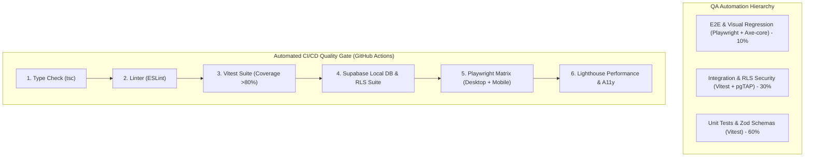

# 🤖 QA Automation Architecture & Testing Framework
## My Finance — End-to-End Automated Quality Engineering

---

## 1. QA Automation Overview & Objectives

Dokumen ini mendefinisikan arsitektur, konfigurasi, kerangka kerja (*framework*), dan tata kelola otomatisasi pengujian (*QA Automation*) untuk aplikasi **My Finance**. 

### Sasaran Utama QA Automation:
1. **Financial Integrity & Zero Drift**: Memverifikasi secara otomatis bahwa 100% mutasi transaksi memperbarui saldo dompet (*wallet balances*) dan target tabungan (*goals*) secara akurat tanpa pembulatan menyimpang.
2. **Multi-Tenant Security Enforcement**: Memastikan pengujian otomatis pada PostgreSQL Row Level Security (RLS) mencegah kebocoran data antar-keluarga.
3. **Cross-Platform Visual & Functional Parity**: Menguji konsistensi fungsional dan visual di layar smartphone (Mobile-First iOS/Android viewports) hingga layar desktop ultra-wide.
4. **CI/CD Quality Gates**: Memblokir merge pull request jika terdapat regresi kode, penurunan *code coverage* di bawah 80%, atau pelanggaran aksesibilitas WCAG 2.1 AA.

---

## 2. Test Pyramid & Automation Stack



| Layer Pengujian | Teknologi / Framework | Target Eksekusi |
|---|---|---|
| **Unit Testing** | **Vitest** | Validasi utilitas matematika finansial, skema Zod, formatters mata uang & tanggal. |
| **Component Testing** | **React Testing Library + Vitest** | Interaksi form modal, feedback toast, visual indicator status budget. |
| **Integration Testing** | **Vitest + Supabase Test Client** | Validasi Server Actions, otorisasi RBAC, revalidasi cache, dan error handling. |
| **Database & RLS Testing** | **pgTAP + Supabase Local CLI** | Uji penetrasi RLS database multi-tenant dan verifikasi trigger saldo atomik. |
| **End-to-End (E2E) Testing**| **Playwright** | Pengujian alur pengguna nyata secara headless & paralel (Chromium, WebKit, Mobile). |
| **Accessibility (A11y)** | **@axe-core/playwright** | Pengecekan otomatis kontras warna, atribut ARIA, dan navigasi keyboard. |
| **Performance & SEO** | **Lighthouse CI (@lhci/cli)** | Pengecekan skor performa web (>90), Best Practices, dan PWA readiness. |

---

## 3. Direktori Kerangka Kerja Pengujian (*Test Folder Structure*)

```
my_finance/
├── tests/
│   ├── unit/                               # Pengujian unit murni
│   │   ├── finance-math.test.ts            # Kalkulasi saldo, health score, net worth
│   │   ├── zod-schemas.test.ts             # Validasi payload transaksi, wallet, budget
│   │   └── formatters.test.ts              # Format mata uang IDR, tanggal i18n
│   ├── integration/                        # Pengujian integrasi Server Actions
│   │   ├── server-actions-wallets.test.ts  # CRUD dompet & hak akses
│   │   ├── server-actions-trans.test.ts    # Mutasi transaksi, transfer & validasi
│   │   └── server-actions-budgets.test.ts  # Alokasi budget & threshold triggers
│   ├── e2e/                                # End-to-End Test Suite (Playwright)
│   │   ├── auth.setup.ts                   # Auth state generator & session cookies
│   │   ├── onboarding.spec.ts              # 7-step onboarding flow
│   │   ├── transaction-flow.spec.ts        # Input pemasukan, pengeluaran & upload struk
│   │   ├── transfer-flow.spec.ts           # Mutasi antar-rekening & verifikasi saldo
│   │   ├── budget-alerts.spec.ts           # Verifikasi warning status (Aman, Waspada, Danger)
│   │   ├── financial-goals.spec.ts         # Pembuatan target & alokasi tabungan
│   │   └── export-reports.spec.ts          # Validasi generate PDF, Excel & CSV
│   ├── database/                           # Database & RLS automated tests
│   │   ├── 01_rls_multi_tenant.test.sql    # Uji isolasi data antar-keluarga
│   │   └── 02_triggers_atomic_balance.test.sql # Uji trigger perhitungan saldo atomik
│   ├── fixtures/                           # Mock data & database seeding
│   │   ├── mock-users.ts                   # Data mock pengguna (Owner, Admin, Member)
│   │   ├── mock-transactions.ts            # Data mock transaksi berbagai tipe
│   │   └── test-seed.sql                   # SQL seeding untuk testing database
│   └── page-objects/                       # Page Object Model (POM) untuk E2E
│       ├── DashboardPage.ts
│       ├── TransactionsPage.ts
│       ├── BudgetingPage.ts
│       └── GoalsPage.ts
├── playwright.config.ts                    # Konfigurasi Playwright E2E Runner
├── vitest.config.ts                        # Konfigurasi Vitest Runner
└── lighthouserc.json                       # Konfigurasi Lighthouse CI
```

---

## 4. Konfigurasi Framework Otomatisasi

### 4.1 `vitest.config.ts` (Unit & Integration Config)
```typescript
import { defineConfig } from 'vitest/config';
import react from '@vitejs/plugin-react';
import tsconfigPaths from 'vite-tsconfig-paths';

export default defineConfig({
  plugins: [react(), tsconfigPaths()],
  test: {
    environment: 'happy-dom',
    globals: true,
    setupFiles: ['./tests/setup.ts'],
    include: ['tests/unit/**/*.test.ts', 'tests/integration/**/*.test.ts'],
    coverage: {
      provider: 'v8',
      reporter: ['text', 'json', 'html', 'lcov'],
      exclude: ['node_modules/', '.next/', 'docs/', 'types/'],
      thresholds: {
        lines: 80,
        functions: 80,
        branches: 80,
        statements: 80,
      },
    },
  },
});
```

---

### 4.2 `playwright.config.ts` (E2E & Multi-Device Config)
```typescript
import { defineConfig, devices } from '@playwright/test';

export default defineConfig({
  testDir: './tests/e2e',
  fullyParallel: true,
  forbidOnly: !!process.env.CI,
  retries: process.env.CI ? 2 : 0,
  workers: process.env.CI ? 2 : undefined,
  reporter: [
    ['html', { outputFolder: 'playwright-report', open: 'never' }],
    ['list'],
  ],
  use: {
    baseURL: process.env.PLAYWRIGHT_BASE_URL || 'http://localhost:3000',
    trace: 'on-first-retry',
    screenshot: 'only-on-failure',
    video: 'retain-on-failure',
  },
  projects: [
    // Setup authentication state
    { name: 'setup', testMatch: /.*\.setup\.ts/ },

    // Desktop Browsers
    {
      name: 'chromium-desktop',
      use: { ...devices['Desktop Chrome'], storageState: 'playwright/.auth/user.json' },
      dependencies: ['setup'],
    },
    {
      name: 'webkit-desktop',
      use: { ...devices['Desktop Safari'], storageState: 'playwright/.auth/user.json' },
      dependencies: ['setup'],
    },

    // Mobile-First Testing Viewports
    {
      name: 'mobile-iphone-15',
      use: { ...devices['iPhone 15 Pro'], storageState: 'playwright/.auth/user.json' },
      dependencies: ['setup'],
    },
    {
      name: 'mobile-pixel-7',
      use: { ...devices['Pixel 7'], storageState: 'playwright/.auth/user.json' },
      dependencies: ['setup'],
    },
  ],
});
```

---

## 5. Implementasi Test Automation Suite (Contoh Nyata)

---

### 5.1 E2E Page Object Model (POM): `TransactionsPage.ts`
```typescript
import { type Page, type Locator, expect } from '@playwright/test';

export class TransactionsPage {
  readonly page: Page;
  readonly quickAddBtn: Locator;
  readonly transactionTypeTab: Locator;
  readonly amountInput: Locator;
  readonly walletSelect: Locator;
  readonly categorySelect: Locator;
  readonly descriptionInput: Locator;
  readonly submitBtn: Locator;
  readonly toastMessage: Locator;
  readonly transactionsTable: Locator;

  constructor(page: Page) {
    this.page = page;
    this.quickAddBtn = page.locator('button[data-testid="btn-add-transaction"]');
    this.amountInput = page.locator('input[name="amount"]');
    this.walletSelect = page.locator('select[name="walletId"]');
    this.categorySelect = page.locator('select[name="categoryId"]');
    this.descriptionInput = page.locator('input[name="description"]');
    this.submitBtn = page.locator('button[data-testid="btn-submit-transaction"]');
    this.toastMessage = page.locator('.sonner-toast');
    this.transactionsTable = page.locator('table[data-testid="transactions-ledger"]');
  }

  async navigate() {
    await this.page.goto('/transactions');
  }

  async addExpense(amount: string, walletName: string, categoryName: string, desc: string) {
    await this.quickAddBtn.click();
    await this.page.click('button[role="tab"]:has-text("Pengeluaran")');
    await this.amountInput.fill(amount);
    await this.walletSelect.selectOption({ label: walletName });
    await this.categorySelect.selectOption({ label: categoryName });
    await this.descriptionInput.fill(desc);
    await this.submitBtn.click();
  }

  async verifyTransactionSuccess(description: string, formattedAmount: string) {
    await expect(this.toastMessage).toContainText('Transaksi berhasil disimpan');
    await expect(this.transactionsTable).toContainText(description);
    await expect(this.transactionsTable).toContainText(formattedAmount);
  }
}
```

---

### 5.2 E2E Test Suite: `transaction-flow.spec.ts`
```typescript
import { test, expect } from '@playwright/test';
import { TransactionsPage } from '../page-objects/TransactionsPage';
import AxeBuilder from '@axe-core/playwright';

test.describe('Automated Transaction Management & A11y', () => {
  let transPage: TransactionsPage;

  test.beforeEach(async ({ page }) => {
    transPage = new TransactionsPage(page);
    await transPage.navigate();
  });

  test('User berhasil mencatat transaksi pengeluaran baru dan saldo berkurang', async () => {
    await transPage.addExpense('150000', 'BCA Utama', 'Makanan & Minuman', 'Belanja Mingguan');
    await transPage.verifyTransactionSuccess('Belanja Mingguan', '-Rp 150.000');
  });

  test('Halaman transaksi memenuhi standar aksesibilitas WCAG 2.1 AA', async ({ page }) => {
    const accessibilityScanResults = await new AxeBuilder({ page })
      .withTags(['wcag2a', 'wcag2aa', 'wcag21a', 'wcag21aa'])
      .analyze();

    expect(accessibilityScanResults.violations).toEqual([]);
  });
});
```

---

### 5.3 Automated RLS Security Test: `01_rls_multi_tenant.test.sql`
```sql
-- Evaluasi isolasi data multi-tenant dengan pgTAP
BEGIN;
SELECT plan(4);

-- Test 1: User Family A membaca data Family A
SET LOCAL request.jwt.claim.sub = '00000000-0000-0000-0000-000000000001';
SELECT cmp_ok(
    (SELECT count(*)::int FROM public.wallets),
    '=',
    2,
    'User Family A HANYA dapat melihat 2 dompet milik keluarganya'
);

-- Test 2: User Family A mencoba mengakses dompet Family B
SELECT is_empty(
    $$ SELECT * FROM public.wallets WHERE family_id = '00000000-0000-0000-0000-000000000002' $$,
    'User Family A diblokir oleh RLS saat mencari dompet Family B'
);

-- Test 3: Member biasa (bukan Admin/Owner) mencoba membuat Budget (Harus Gagal)
SET LOCAL request.jwt.claim.sub = '00000000-0000-0000-0000-000000000003'; -- Member Role
PREPARE insert_member_budget AS
INSERT INTO public.budgets (family_id, category_id, period_month, amount_limit)
VALUES ('00000000-0000-0000-0000-000000000001', 'cat-uuid', '2026-09-01', 5000000);

SELECT throws_ok(
    'insert_member_budget',
    'new row violates row-level security policy for table "budgets"',
    'Member biasa dilarang menyisipkan budget (Hanya Owner/Admin)'
);

SELECT * FROM finish();
ROLLBACK;
```

---

## 6. Pipeline CI/CD QA Automation (GitHub Actions)

File: `.github/workflows/qa-automation.yml`

```yaml
name: QA Automation & Quality Gate

on:
  push:
    branches: [main, develop]
  pull_request:
    branches: [main, develop]

jobs:
  static_analysis:
    name: Type Check & Linting
    runs-on: ubuntu-latest
    steps:
      - uses: actions/checkout@v4
      - uses: actions/setup-node@v4
        with: { node-version: 20, cache: 'npm' }
      - run: npm ci
      - run: npm run lint
      - run: npx tsc --noEmit

  unit_and_integration:
    name: Vitest Unit & Integration
    runs-on: ubuntu-latest
    steps:
      - uses: actions/checkout@v4
      - uses: actions/setup-node@v4
        with: { node-version: 20, cache: 'npm' }
      - run: npm ci
      - run: npm run test:coverage
      - name: Upload Coverage Artifact
        uses: actions/upload-artifact@v4
        with:
          name: code-coverage-report
          path: coverage/

  database_rls_security:
    name: Database RLS Security (pgTAP)
    runs-on: ubuntu-latest
    steps:
      - uses: actions/checkout@v4
      - uses: supabase/setup-cli@v1
      - run: supabase start
      - run: supabase test db

  playwright_e2e_matrix:
    name: Playwright E2E Suite (${{ matrix.project }})
    needs: [static_analysis, unit_and_integration]
    runs-on: ubuntu-latest
    strategy:
      fail-fast: false
      matrix:
        project: [chromium-desktop, webkit-desktop, mobile-iphone-15]
    steps:
      - uses: actions/checkout@v4
      - uses: actions/setup-node@v4
        with: { node-version: 20, cache: 'npm' }
      - run: npm ci
      - run: npx playwright install --with-deps
      - run: npx playwright test --project=${{ matrix.project }}
      - name: Upload Test Report & Trace
        if: failure()
        uses: actions/upload-artifact@v4
        with:
          name: playwright-failure-${{ matrix.project }}
          path: |
            playwright-report/
            test-results/
```

---

## 7. QA Quality Gates & Release SLA

Setiap rilis rintisan atau promosi ke lingkungan produksi wajib memenuhi kriteria:

1. **Test Pass Rate**: 100% lulus tanpa ada test yang *flaky* atau *skipped*.
2. **Code Coverage**: Minimal **80%** untuk Statement, Branch, dan Functions.
3. **A11y Violations**: 0 pelanggaran berstatus *critical* atau *serious* pada pemindaian Axe-core.
4. **Lighthouse Performance Score**: Minimal skor **90** pada uji Lighthouse CI.
5. **E2E Execution Time**: Total waktu eksekusi suite E2E paralel `< 10 menit`.
