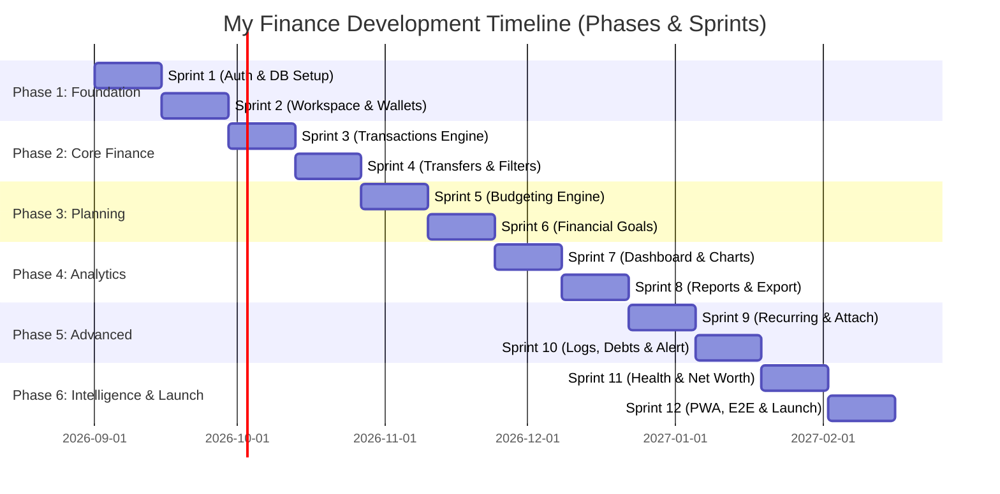

# 🚀 Development Roadmap: Phases & Sprints
## My Finance — Product Execution & Release Plan

---

## 1. Overview & Development Strategy

Roadmap pengembangan **My Finance** dirancang dengan metodologi **Agile / Scrum**. Proyek ini dibagi menjadi **6 Fase Utama**, di mana setiap fase terdiri dari **2 Sprint** berdurasi 2 minggu per sprint (total 12 Sprint / 24 minggu siklus rilis).

Struktur ini memastikan pengiriman nilai (*business value*) secara bertahap, validasi arsitektur sejak dini, dan kesiapan produk untuk digunakan langsung (*production-ready*) oleh keluarga.



---

## 2. Rincian Fase & Sprint

---

### 🟢 PHASE 1: FOUNDATION & SHARED WORKSPACE
**Fokus**: Infrastruktur inti, otentikasi Google OAuth, database PostgreSQL DDL, RLS multi-tenant, dan arsitektur workspace keluarga.

#### 🏃‍♂️ Sprint 1: Database Setup, Security RLS & Supabase Auth
- **Durasi**: Minggu 1 – 2
- **Tujuan Sprint**: Memastikan infrastruktur database Supabase, otentikasi Google OAuth, trigger profil otomatis, dan isolasi keamanan RLS siap pakai.
- **Task Backlog**:
  1. Setup repositori Next.js 16 (App Router), TypeScript, Tailwind CSS 4, shadcn/ui.
  2. Inisialisasi Supabase project & eksekusi DDL database (`users`, `families`, `family_members`).
  3. Konfigurasi Google Cloud Console OAuth 2.0 Credentials.
  4. Implementasi Next.js SSR middleware untuk proteksi rute (`middleware.ts`).
  5. Pembuatan trigger database `handle_new_user()` untuk sinkronisasi profil pengguna.
  6. Penerapan kebijakan Row Level Security (RLS) pada tabel otentikasi dan anggota keluarga.
- **Deliverables**:
  - Pengguna dapat login via Google OAuth.
  - Sesi tersimpan aman di cookie HTTP-Only.
  - Data antar-pengguna terisolasi di database.

#### 🏃‍♂️ Sprint 2: Family Workspace, RBAC Roles & Multi-Wallet Setup
- **Durasi**: Minggu 3 – 4
- **Tujuan Sprint**: Menyediakan fungsionalitas pembuatan ruang kerja keluarga (*shared workspace*), sistem undangan, peran (Owner/Admin/Member), dan manajemen rekening/dompet.
- **Task Backlog**:
  1. Pembuatan Server Actions untuk `createFamily()`, `joinFamilyByCode()`, dan `inviteMember()`.
  2. Implementasi skema tabel `wallets` dan fungsi CRUD dompet.
  3. Desain dan integrasi komponen kartu rekening (*Wallet Cards*) di UI.
  4. Implementasi alur Onboarding Wizard 7-langkah untuk pengguna baru.
  5. Konfigurasi modul tema (Dark/Light/System) dan lokalisasi i18n (ID/EN).
- **Deliverables**:
  - Pengguna baru dapat membuat keluarga atau bergabung via kode undangan.
  - Pengguna dapat menambahkan akun/dompet (Kas, Bank BCA, Mandiri, E-Wallet GoPay, dll.).
  - Onboarding Wizard berjalan mulus.

---

### 🟢 PHASE 2: CORE FINANCIAL ENGINE & TRANSACTIONS
**Fokus**: Pencatatan mutasi transaksi (Pemasukan, Pengeluaran, Transfer), kalkulasi saldo atomik, pencarian, dan unggah bukti struk.

#### 🏃‍♂️ Sprint 3: Transactions CRUD, Categories & Receipt Upload
- **Durasi**: Minggu 5 – 6
- **Tujuan Sprint**: Membangun modul pencatatan transaksi pemasukan dan pengeluaran dengan validasi Zod ketat serta upload struk ke Supabase Storage.
- **Task Backlog**:
  1. DDL tabel `categories` dan `transactions` beserta indeks komposit.
  2. Trigger PostgreSQL `update_wallet_balance_on_transaction()` untuk update saldo otomatis.
  3. Form transaksi responsif (Quick Add Modal) dengan pemilih kategori dan kalkulator nominal.
  4. Integrasi Supabase Storage bucket `receipts` dengan validasi MIME & batas ukuran 5MB.
  5. Komponen pratinjau bukti nota transaksi.
- **Deliverables**:
  - Pengguna dapat mencatat pemasukan dan pengeluaran secara instan.
  - Saldo dompet terupdate secara atomik dan akurat.
  - Bukti struk tersimpan aman di cloud storage.

#### 🏃‍♂️ Sprint 4: Inter-Wallet Transfers, Advanced Filters & Ledger View
- **Durasi**: Minggu 7 – 8
- **Tujuan Sprint**: Menyelesaikan fitur perpindahan dana antar-dompet (*transfer*), filter transaksi multi-dimensi, dan tabel histori transaksi.
- **Task Backlog**:
  1. Logika transfer antar-wallet (memotong saldo dompet asal dan menambah saldo dompet tujuan tanpa merusak total cash flow).
  2. Drawer filter transaksi: filter rentang tanggal, kategori, dompet, tipe, dan pencarian kata kunci.
  3. Pagination dan infinite scroll pada histori transaksi.
  4. Fitur soft delete dan konfirmasi penghapusan transaksi.
- **Deliverables**:
  - Transfer dana antar-bank/e-wallet berfungsi sempurna.
  - Pengguna dapat mencari dan memfilter transaksi dengan cepat.

---

### 🟢 PHASE 3: FINANCIAL PLANNING (BUDGETING & GOALS)
**Fokus**: Perencanaan anggaran bulanan (*budgeting*), indikator status batas pengeluaran, target tabungan (*financial goals*), dan buku alokasi kontribusi dana.

#### 🏃‍♂️ Sprint 5: Monthly Budgeting & Dynamic Warning Engine
- **Durasi**: Minggu 9 – 10
- **Tujuan Sprint**: Menyediakan alat kontrol pengeluaran keluarga melalui alokasi anggaran bulanan per kategori beserta visualisasi status batas aman.
- **Task Backlog**:
  1. DDL tabel `budgets` dan Server Actions `setCategoryBudget()`.
  2. Engine penghitungan persentase realisasi anggaran terhadap transaksi aktual bulan berjalan.
  3. UI Kartu Budget dengan status warna adaptif: Hijau (<70%), Kuning (70-90%), Merah (>90%).
  4. Fitur duplikasi anggaran dari bulan sebelumnya (*budget rollover*).
- **Deliverables**:
  - Keluarga dapat mengatur limit pengeluaran bulanan per kategori.
  - Visualisasi progress bar real-time yang memperingatkan jika anggaran mendekati batas.

#### 🏃‍♂️ Sprint 6: Financial Goals & Savings Contribution Ledger
- **Durasi**: Minggu 11 – 12
- **Tujuan Sprint**: Membantu keluarga mencapai target tabungan (dana darurat, liburan, rumah) dengan pencatatan kontribusi dana terdedikasi.
- **Task Backlog**:
  1. DDL tabel `financial_goals` dan `goal_contributions`.
  2. Trigger otomatis `update_goal_amount_on_contribution()`.
  3. Form alokasi tabungan: memotong saldo wallet dan menambah progres tabungan target.
  4. Kartu target finansial dengan visual progress lingkaran (*radial progress*), estimasi waktu, dan perayaan saat target tercapai (*celebration modal*).
- **Deliverables**:
  - Target finansial dapat dibuat dengan target nominal dan tenggat waktu.
  - Setiap penyisihan uang tercatat dalam buku besar kontribusi.

---

### 🟢 PHASE 4: ANALYTICS, DASHBOARD & REPORTING
**Fokus**: Dashboard eksekutif keluarga, visualisasi grafik interaktif, analisis kontribusi anggota, dan ekspor laporan (PDF, Excel, CSV).

#### 🏃‍♂️ Sprint 7: Interactive Executive Dashboard & Charts
- **Durasi**: Minggu 13 – 14
- **Tujuan Sprint**: Menghadirkan ringkasan kondisi finansial keluarga dalam dashboard interaktif berbasis Recharts.
- **Task Backlog**:
  1. Summary KPI Cards: Total Saldo, Pemasukan Bulan Ini, Pengeluaran Bulan Ini, Net Cash Flow, Savings Rate.
  2. Visualisasi Recharts: Area chart arus kas bulanan, Donut chart pengeluaran per kategori, Stacked bar chart kontribusi pengeluaran per anggota.
  3. Integrasi widget budget dan target finansial di dashboard utama.
  4. Optimasi query agregasi database untuk loading dashboard secepat kilat (<300ms).
- **Deliverables**:
  - Dashboard interaktif dan informatif siap pakai di desktop maupun mobile.

#### 🏃‍♂️ Sprint 8: Financial Reporting Engine & Multi-Format Export
- **Durasi**: Minggu 15 – 16
- **Tujuan Sprint**: Menyediakan modul pelaporan komprehensif dan ekspor dokumen (PDF formal, Excel .xlsx terstruktur, dan CSV).
- **Task Backlog**:
  1. Pembuatan generator laporan PDF (@react-pdf / jsPDF) dengan format resmi keluarga.
  2. Implementasi Route Handler `/api/export/excel` menggunakan SheetJS.
  3. Implementasi Route Handler `/api/export/csv` untuk interoperabilitas data.
  4. Pratinjau laporan bulanan di layar sebelum diunduh.
- **Deliverables**:
  - Keluarga dapat mengunduh laporan keuangan bulanan dalam format PDF, Excel, dan CSV.

---

### 🟢 PHASE 5: ADVANCED AUTOMATION, AI LOGGING & COLLABORATION
**Fokus**: Otomatisasi transaksi rutin (*recurring*), Vision AI Receipt OCR, Voice/Text natural language parsing, pusat notifikasi, dan audit log.

#### 🏃‍♂️ Sprint 9: Recurring Transactions & Smart AI Receipt OCR
- **Durasi**: Minggu 17 – 18
- **Tujuan Sprint**: Mengotomatiskan pencatatan transaksi berkala dan meluncurkan fitur pemindaian nota struk otomatis berbasis Vision AI (Gemini 1.5 Flash).
- **Task Backlog**:
  1. DDL tabel `recurring_transactions` dan konfigurasi frekuensi (Harian, Mingguan, Bulanan, Tahunan).
  2. Setup Supabase Edge Function / Vercel Cron untuk eksekusi transaksi otomatis.
  3. Integrasi Route Handler `/api/ai/scan-receipt` dengan Vision AI untuk membaca total, tanggal, toko, dan kategori nota belanja.
  4. Komponen UI kamera dan pemindai struk di aplikasi mobile & desktop.
- **Deliverables**:
  - Transaksi berkala tercatat otomatis.
  - Pengguna dapat memotret struk belanja dan data otomatis terisi ke form transaksi.

#### 🏃‍♂️ Sprint 10: Natural Language AI Parser, Notifications & Debt Management
- **Durasi**: Minggu 19 – 20
- **Tujuan Sprint**: Memungkinkan pencatatan transaksi via teks percakapan / pesan suara dan menyediakan transparansi audit aktivitas keluarga.
- **Task Backlog**:
  1. Integrasi Route Handler `/api/ai/parse-transaction` menggunakan LLM Tool/Function Calling.
  2. Tabel `activity_logs` untuk merekam audit log aktivitas keluarga.
  3. Pusat notifikasi in-app (`notifications`) untuk peringatan budget dan pencapaian target tabungan.
  4. Modul manajemen utang & cicilan (`debts`): pelacakan sisa pinjaman dan tagihan bulanan.
- **Deliverables**:
  - Pengguna dapat mencatat transaksi dengan mengetik pesan biasa atau merekam suara.
  - Kewajiban utang dan audit aktivitas keluarga termonitor rapi.

---

### 🟢 PHASE 6: FINANCIAL INTELLIGENCE, QA AUTOMATION & PRODUCTION LAUNCH
**Fokus**: AI Financial Advisor (Chatbot), skor kesehatan finansial, pelacakan kekayaan bersih (*net worth*), kerangka otomatisasi QA, dan peluncuran produksi ke Vercel.

#### 🏃‍♂️ Sprint 11: Interactive AI Financial Advisor & Net Worth Matrix
- **Durasi**: Minggu 21 – 22
- **Tujuan Sprint**: Menghadirkan chatbot perencana keuangan keluarga interaktif berbasis data faktual (bebas halusinasi), algoritma Health Score (0-100), dan tracking Net Worth.
- **Task Backlog**:
  1. Integrasi `/api/ai/advisor-chat` berbasis Vercel AI SDK dengan context injection agregat data keluarga.
  2. Algoritma Financial Health Score berbasis rasio tabungan, disiplin anggaran, dan rasio utang.
  3. Modul pelacakan Net Worth (*Total Assets - Total Liabilities*) dengan grafik tren historis.
  4. Cron generator laporan narasi bulanan keluarga (*Monthly AI Digest*).
- **Deliverables**:
  - Pasangan suami-istri dapat berkonsultasi langsung mengenai cash flow keluarga ke AI Advisor.
  - Skor kesehatan keuangan dan nilai kekayaan bersih keluarga terhitung akurat.

#### 🏃‍♂️ Sprint 12: QA Automation Suite, PWA, Security Hardening & Initial Launch
- **Durasi**: Minggu 23 – 24
- **Tujuan Sprint**: Menjalankan seluruh test suite QA Automation (Unit, Integration, RLS Security, Playwright Multi-device, Axe A11y), konfigurasi PWA, dan deploy produksi ke Vercel.
- **Task Backlog**:
  1. Implementasi automated test suite Playwright E2E pada desktop Chrome, Safari, dan viewport iPhone 15 / Pixel 7.
  2. Otomatisasi pengujian keamanan RLS multi-tenant di PostgreSQL lokal via pgTAP.
  3. Pembuatan Web App Manifest & Service Worker untuk Progressive Web App (PWA).
  4. Audit keamanan OWASP, validasi PII scrubbing pada modul AI, dan rate limiting.
  5. Setup CI/CD GitHub Actions pipeline ke Vercel Production dengan automated quality gates.
- **Deliverables**:
  - Aplikasi **My Finance** rilis ke publik (*Production Ready*), lolos seluruh kriteria QA Automation, dapat diinstal via PWA, dan beroperasi stabil.

---

### 🟢 PHASE 7: NEXT-GEN UX, ERGONOMICS & GEN-Z DESIGN SYSTEM
**Fokus**: Redesign menyeluruh antarmuka premium non-AI slop, animasi halus, skeleton shimmer loading, auto-formatting rupiah real-time, optimistic UI updates, dan dukungan dwibahasa (ID/EN).

#### 🏃‍♂️ Sprint 13: Premium Gen-Z Redesign, Shimmer Skeleton & Multi-Language (ID/EN)
- **Durasi**: Minggu 25 – 26
- **Tujuan Sprint**: Melakukan transformasi visual menyeluruh pada antarmuka pengguna agar modern, elegan, berjiwa Gen-Z, tanpa kesan AI slop, dilengkapi skeleton shimmer loading dan toggle bahasa ID/EN.
- **Task Backlog**:
  1. Redesign sistem tema dan token warna (Dark/Light mode) dengan estetika glassmorphism halus, tipografi kontemporer (Outfit & Inter), dan visual hierarchy yang tegas.
  2. Implementasi komponen *Skeleton Shimmer Loading* untuk menggantikan seluruh spinner konvensional pada Dashboard, Transaksi, Dompet, dan Analitik.
  3. Pembuatan sistem switch dwibahasa (Bahasa Indonesia & English) dengan kamus dictionary i18n terstruktur dan persistensi cookie/localStorage.
  4. Penyesuaian micro-interactions dan feedback animasi menggunakan Tailwind CSS utilities.
- **Deliverables**:
  - Tampilan visual web app tampak eksklusif, rapi, responsif 100%, dan bebas dari kesan template murahan / AI generic.
  - Transisi loading terasa secepat aplikasi native dengan skeleton shimmer.
  - Pengguna dapat beralih bahasa antara Indonesia dan Inggris dengan 1 klik.

#### 🏃‍♂️ Sprint 14: High-Velocity Form Ergonomics & Zero-Latency Optimistic UI
- **Durasi**: Minggu 27 – 28
- **Tujuan Sprint**: Mengoptimalkan kecepatan input transaksi dengan auto-format rupiah interaktif saat mengetik dan implementasi React 19 `useOptimistic` untuk pembaruan data instan (0 ms latency).
- **Task Backlog**:
  1. Pembuatan komponen reusable `<CurrencyInput />` dengan pemformatan rupiah otomatis real-time (mencegah salah ketik jumlah nol).
  2. Integrasi React 19 `useOptimistic` hook pada tabel transaksi dan mutasi rekening untuk respon klik instan sebelum roundtrip server.
  3. Penambahan keyboard shortcuts global (`Ctrl + K` untuk Command Palette pencarian instan, dan `N` untuk form transaksi baru).
  4. Optimasi penanganan form validation error secara visual (*inline field error toast*).
- **Deliverables**:
  - Pengguna mengetik nominal dengan auto-format rupiah yang mulus dan nyaman di mata.
  - Penambahan, pengeditan, dan penghapusan transaksi terjadi secara instan tanpa jeda loading.

---

### 🟢 PHASE 8: ADVANCED TRANSACTION INTELLIGENCE, DEEP FILTERS & FINANCIAL SIMULATIONS
**Fokus**: Filter pencarian multi-dimensi, rekonsiliasi saldo otomatis, indeks database performa tinggi, peringatan visual anggaran cerdas, generator laporan PDF siap cetak, dan kalkulator simulasi keuangan.

#### 🏃‍♂️ Sprint 15: Deep Transaction Filtering, Balance Auto-Reconciliation & Composite Indexing
- **Durasi**: Minggu 29 – 30
- **Tujuan Sprint**: Menyediakan kapabilitas pencarian dan filter transaksi tingkat lanjut, fitur rekonsiliasi saldo dompet otomatis, dan pengoptimalan query PostgreSQL dengan indeks komposit.
- **Task Backlog**:
  1. Implementasi drawer filter mutasi lanjutan di `/transactions` (rentang tanggal custom, rentang nominal min-max, tipe akun dompet, dan multi-select kategori).
  2. Pembuatan fitur dan Server Action `reconcileWalletBalancesAction()` untuk memverifikasi dan menyinkronkan saldo dompet terhadap total riwayat mutasi dari awal.
  3. Penambahan migrasi PostgreSQL composite indexing pada tabel `transactions` (`family_id`, `transaction_date DESC`, `is_deleted`) untuk query super cepat pada dataset besar.
  4. Optimasi pagination transaksi server-side.
- **Deliverables**:
  - Pengguna dapat menemukan mutasi spesifik dalam hitungan detik dengan filter multi-kriteria.
  - Saldo dompet dapat direkonsiliasi otomatis untuk jaminan integritas 100%.
  - Query mutasi puluhan ribu baris berjalan di bawah 50 ms.

#### 🏃‍♂️ Sprint 16: Smart Budget Warning Banners, Financial Simulation Calculators & Printable PDF Reports
- **Durasi**: Minggu 31 – 32
- **Tujuan Sprint**: Menghadirkan notifikasi visual status anggaran di dashboard, tiga kalkulator simulasi finansial interaktif, dan ekspor laporan PDF bulanan resmi siap cetak.
- **Task Backlog**:
  1. Komponen *Smart Budget Warning Banner* di dashboard utama saat salah satu kategori mendekati/melampaui batas limit anggaran (80% / 100%).
  2. Pembuatan suite Kalkulator Simulasi Finansial di `/analytics`:
     - Kalkulator Dana Darurat (Emergency Fund Target berbasis kebutuhan bulanan).
     - Kalkulator Investasi & Bunga Majemuk (Compound Interest Calculator).
     - Simulasi Pelunasan Hutang Tercepat (Metode *Snowball* vs *Avalanche*).
  3. Pembuatan generator laporan keuangan bulanan keluarga dalam format PDF siap cetak (Monthly Financial Statement) berlayout elegan dengan tabel mutasi, logo keluarga, dan ringkasan arus kas.
- **Deliverables**:
  - Peringatan dini over-budgeting tampil jelas di dashboard.
  - Pengguna dapat merencanakan masa depan keuangan dengan simulasi interaktif.
  - Laporan keuangan keluarga dapat diunduh dalam PDF resmi untuk arsip atau cetak.

---

### 🟢 PHASE 9: MULTIMODAL AI AUTOMATION, MULTI-RECEIPT & CONTEXTUAL INSIGHTS
**Fokus**: Peningkatan kemampuan Gemini AI untuk upload multi-struk belanja sekaligus, auto-sugesti kategori cerdas saat mengetik, analisis tren mingguan, dan pengingat jatuh tempo tagihan via WhatsApp/Email.

#### 🏃‍♂️ Sprint 17: Gemini Multi-Receipt Batch OCR & Real-Time Contextual Auto-Categorization
- **Durasi**: Minggu 33 – 34
- **Tujuan Sprint**: Mengizinkan pengguna mengunggah 2–5 foto struk belanja sekaligus untuk ekstraksi paralel oleh Gemini Vision AI dan menghadirkan auto-kategori cerdas instan saat mengetik deskripsi transaksi.
- **Task Backlog**:
  1. Pembuatan antarmuka modal upload multi-nota (Batch Receipt Scanner) yang memproses hingga 5 gambar struk belanja secara asinkron.
  2. Pipeline antrian ekstraksi OCR Gemini AI dengan validasi total belanja dan daftar item per struk.
  3. Endpoint auto-categorization instan dengan *debounced typing predictor* yang otomatis mencocokkan teks deskripsi dengan kategori keluarga tanpa klik dropdown.
- **Deliverables**:
  - Pengguna dapat memfoto tumpukan struk sekaligus dan langsung mendapatkan draft transaksi berurutan.
  - Kategori transaksi terisi otomatis saat pengguna selesai mengetik keterangan.

#### 🏃‍♂️ Sprint 18: Weekly AI Financial Digest & Automated Bill/Debt Due Reminders
- **Durasi**: Minggu 35 – 36
- **Tujuan Sprint**: Menyediakan rangkuman tren pengeluaran mingguan dengan rekomendasi penghematan cerdas oleh AI, serta tombol/notifikasi pengingat jatuh tempo tagihan dan hutang.
- **Task Backlog**:
  1. Modul AI Spending Trend Analyzer yang membandingkan performa arus kas 7 hari terakhir dan memberikan tip hemat kontekstual.
  2. Pembuatan widget *Weekly AI Financial Insights* di dashboard dan menu advisor.
  3. Fitur *One-Click Debt Reminder Link* (WhatsApp & Email preview) untuk mengingatkan pihak peminjam atau anggota keluarga sebelum jatuh tempo cicilan/piutang.
  4. Pengingat jadwal tagihan berulang (*recurring bills countdown*).
- **Deliverables**:
  - Keluarga mendapatkan wawasan keuangan mingguan yang mudah dipahami dan aplikatif.
  - Tidak ada lagi tagihan atau hutang yang terlewat jatuh temponya.

---

### 🟢 PHASE 10: ENTERPRISE FAMILY GOVERNANCE, ROLE ACCESS CONTROL & AUDIT LOGS
**Fokus**: Manajemen hak akses anggota keluarga (RBAC granular), pembatasan akses rekening tertentu, dan pencatatan audit log perubahan aktivitas secara komprehensif.

#### 🏃‍♂️ Sprint 19: Granular Family Member Management & RBAC Permissions Matrix
- **Durasi**: Minggu 37 – 38
- **Tujuan Sprint**: Memperluas manajemen anggota keluarga dengan matriks peran granular (Owner, Admin, Member, View-Only) serta pengaturan izin per-dompet (*wallet-level access permission*).
- **Task Backlog**:
  1. Pembuatan halaman Manajemen Hak Akses Keluarga di `/settings` atau `/family`.
  2. Implementasi matriks perizinan:
     - **Owner**: Kontrol penuh (hapus keluarga, kelola langganan, ubah semua data).
     - **Admin**: Menambah/mengedit seluruh transaksi, dompet, dan anggaran.
     - **Member**: Hanya dapat mencatat transaksi pada dompet yang diizinkan.
     - **View-Only (Anak/Auditor)**: Hanya dapat melihat dashboard dan laporan tanpa hak edit.
  3. Kebijakan PostgreSQL RLS tambahan yang mengevaluasi hak akses per-dompet pengguna.
- **Deliverables**:
  - Kepala keluarga dapat mengatur siapa saja yang berhak melihat atau mengelola rekening tertentu.
  - Privasi rekening pribadi tetap terjaga meski berada di ruang kerja keluarga bersama.

#### 🏃‍♂️ Sprint 20: Comprehensive Activity Audit Log & System Observability
- **Durasi**: Minggu 39 – 40
- **Tujuan Sprint**: Membangun halaman audit log aktivitas keluarga (`/activity`) untuk melacak riwayat penambahan, modifikasi, dan penghapusan data secara transparan.
- **Task Backlog**:
  1. Halaman Riwayat Perubahan Keluarga (`/activity`) dengan filter per anggota, per entitas (transaksi, dompet, anggaran), dan rentang waktu.
  2. Trigger pencatatan audit log otomatis pada level database PostgreSQL untuk transaksi nominal besar (> Rp 10.000.000) dan perubahan parameter penting.
  3. Visualisasi *Diff Viewer* untuk melihat data sebelum dan sesudah diedit oleh anggota keluarga.
  4. Pengujian regresi menyeluruh pada seluruh 20 sprint dan final release packaging.
- **Deliverables**:
  - Seluruh perubahan data keluarga terdokumentasi rapi dan dapat ditelusuri riwayatnya secara akurat.
  - Ekosistem aplikasi **MY FINANCE** mencapai tingkat kematangan maksimal kelas enterprise.

---

## 3. Matriks Ketergantungan Antar-Sprint (Sprint 1 - 20)

```
[Phase 1 - 6: Baseline MVP & Production Foundation (Sprint 1 - 12)]
                               │
                               ▼
Sprint 13 (Gen-Z Redesign & i18n) ──► Sprint 14 (Currency Formatter & Optimistic UI)
                               │
                               ▼
Sprint 15 (Deep Filters & Reconcile) ──► Sprint 16 (Budget Warning, Simulators & PDF)
                               │
                               ▼
Sprint 17 (Multi-Receipt & Auto-Cat) ──► Sprint 18 (Weekly AI Digest & Due Reminders)
                               │
                               ▼
Sprint 19 (Family RBAC & Permissions) ──► Sprint 20 (Activity Audit Logs & Observability)
```

---

## 4. Definisi Selesai (Definition of Done - DoD)
Setiap task dalam sprint dinyatakan selesai jika memenuhi kriteria berikut:
1. Kode ditulis dengan TypeScript tanpa `any` dan lolos linter ESLint.
2. Form, API, dan output AI divalidasi ketat oleh skema Zod.
3. Hak akses diuji dan diverifikasi mematuhi PostgreSQL Row Level Security (RLS).
4. Tampilan responsif diuji pada resolusi mobile (375px), tablet (768px), dan desktop (1440px).
5. Memiliki Unit Test / Integration Test dengan code coverage minimal **80%**.
6. Lolos uji aksesibilitas otomatis **WCAG 2.1 Level AA** tanpa pelanggaran serius.
7. Berhasil lolos build di Vercel Deployment tanpa error.

