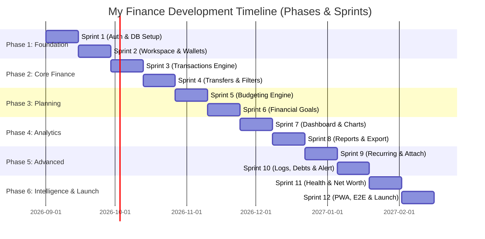

# 🚀 Development Roadmap: Phases & Sprints
## My Finance — Product Execution & Release Plan

---

## 1. Overview & Development Strategy

Roadmap pengembangan **My Finance** dirancang dengan metodologi **Agile / Scrum**. Proyek ini dibagi menjadi **6 Fase Utama**, di mana setiap fase terdiri dari **2 Sprint** berdurasi 2 minggu per sprint (total 12 Sprint / 24 minggu siklus rilis).

Struktur ini memastikan pengiriman nilai (*business value*) secara bertahap, validasi arsitektur sejak dini, dan kesiapan produk untuk digunakan langsung (*production-ready*) oleh keluarga.



---

## 2. Rincian Fase & Sprint

---

### 🟢 PHASE 1: FOUNDATION & SHARED WORKSPACE
**Fokus**: Infrastruktur inti, otentikasi Google OAuth, database PostgreSQL DDL, RLS multi-tenant, dan arsitektur workspace keluarga.

#### 🏃‍♂️ Sprint 1: Database Setup, Security RLS & Supabase Auth
- **Durasi**: Minggu 1 – 2
- **Tujuan Sprint**: Memastikan infrastruktur database Supabase, otentikasi Google OAuth, trigger profil otomatis, dan isolasi keamanan RLS siap pakai.
- **Task Backlog**:
  1. Setup repositori Next.js 16 (App Router), TypeScript, Tailwind CSS 4, shadcn/ui.
  2. Inisialisasi Supabase project & eksekusi DDL database (`users`, `families`, `family_members`).
  3. Konfigurasi Google Cloud Console OAuth 2.0 Credentials.
  4. Implementasi Next.js SSR middleware untuk proteksi rute (`middleware.ts`).
  5. Pembuatan trigger database `handle_new_user()` untuk sinkronisasi profil pengguna.
  6. Penerapan kebijakan Row Level Security (RLS) pada tabel otentikasi dan anggota keluarga.
- **Deliverables**:
  - Pengguna dapat login via Google OAuth.
  - Sesi tersimpan aman di cookie HTTP-Only.
  - Data antar-pengguna terisolasi di database.

#### 🏃‍♂️ Sprint 2: Family Workspace, RBAC Roles & Multi-Wallet Setup
- **Durasi**: Minggu 3 – 4
- **Tujuan Sprint**: Menyediakan fungsionalitas pembuatan ruang kerja keluarga (*shared workspace*), sistem undangan, peran (Owner/Admin/Member), dan manajemen rekening/dompet.
- **Task Backlog**:
  1. Pembuatan Server Actions untuk `createFamily()`, `joinFamilyByCode()`, dan `inviteMember()`.
  2. Implementasi skema tabel `wallets` dan fungsi CRUD dompet.
  3. Desain dan integrasi komponen kartu rekening (*Wallet Cards*) di UI.
  4. Implementasi alur Onboarding Wizard 7-langkah untuk pengguna baru.
  5. Konfigurasi modul tema (Dark/Light/System) dan lokalisasi i18n (ID/EN).
- **Deliverables**:
  - Pengguna baru dapat membuat keluarga atau bergabung via kode undangan.
  - Pengguna dapat menambahkan akun/dompet (Kas, Bank BCA, Mandiri, E-Wallet GoPay, dll.).
  - Onboarding Wizard berjalan mulus.

---

### 🟢 PHASE 2: CORE FINANCIAL ENGINE & TRANSACTIONS
**Fokus**: Pencatatan mutasi transaksi (Pemasukan, Pengeluaran, Transfer), kalkulasi saldo atomik, pencarian, dan unggah bukti struk.

#### 🏃‍♂️ Sprint 3: Transactions CRUD, Categories & Receipt Upload
- **Durasi**: Minggu 5 – 6
- **Tujuan Sprint**: Membangun modul pencatatan transaksi pemasukan dan pengeluaran dengan validasi Zod ketat serta upload struk ke Supabase Storage.
- **Task Backlog**:
  1. DDL tabel `categories` dan `transactions` beserta indeks komposit.
  2. Trigger PostgreSQL `update_wallet_balance_on_transaction()` untuk update saldo otomatis.
  3. Form transaksi responsif (Quick Add Modal) dengan pemilih kategori dan kalkulator nominal.
  4. Integrasi Supabase Storage bucket `receipts` dengan validasi MIME & batas ukuran 5MB.
  5. Komponen pratinjau bukti nota transaksi.
- **Deliverables**:
  - Pengguna dapat mencatat pemasukan dan pengeluaran secara instan.
  - Saldo dompet terupdate secara atomik dan akurat.
  - Bukti struk tersimpan aman di cloud storage.

#### 🏃‍♂️ Sprint 4: Inter-Wallet Transfers, Advanced Filters & Ledger View
- **Durasi**: Minggu 7 – 8
- **Tujuan Sprint**: Menyelesaikan fitur perpindahan dana antar-dompet (*transfer*), filter transaksi multi-dimensi, dan tabel histori transaksi.
- **Task Backlog**:
  1. Logika transfer antar-wallet (memotong saldo dompet asal dan menambah saldo dompet tujuan tanpa merusak total cash flow).
  2. Drawer filter transaksi: filter rentang tanggal, kategori, dompet, tipe, dan pencarian kata kunci.
  3. Pagination dan infinite scroll pada histori transaksi.
  4. Fitur soft delete dan konfirmasi penghapusan transaksi.
- **Deliverables**:
  - Transfer dana antar-bank/e-wallet berfungsi sempurna.
  - Pengguna dapat mencari dan memfilter transaksi dengan cepat.

---

### 🟢 PHASE 3: FINANCIAL PLANNING (BUDGETING & GOALS)
**Fokus**: Perencanaan anggaran bulanan (*budgeting*), indikator status batas pengeluaran, target tabungan (*financial goals*), dan buku alokasi kontribusi dana.

#### 🏃‍♂️ Sprint 5: Monthly Budgeting & Dynamic Warning Engine
- **Durasi**: Minggu 9 – 10
- **Tujuan Sprint**: Menyediakan alat kontrol pengeluaran keluarga melalui alokasi anggaran bulanan per kategori beserta visualisasi status batas aman.
- **Task Backlog**:
  1. DDL tabel `budgets` dan Server Actions `setCategoryBudget()`.
  2. Engine penghitungan persentase realisasi anggaran terhadap transaksi aktual bulan berjalan.
  3. UI Kartu Budget dengan status warna adaptif: Hijau (<70%), Kuning (70-90%), Merah (>90%).
  4. Fitur duplikasi anggaran dari bulan sebelumnya (*budget rollover*).
- **Deliverables**:
  - Keluarga dapat mengatur limit pengeluaran bulanan per kategori.
  - Visualisasi progress bar real-time yang memperingatkan jika anggaran mendekati batas.

#### 🏃‍♂️ Sprint 6: Financial Goals & Savings Contribution Ledger
- **Durasi**: Minggu 11 – 12
- **Tujuan Sprint**: Membantu keluarga mencapai target tabungan (dana darurat, liburan, rumah) dengan pencatatan kontribusi dana terdedikasi.
- **Task Backlog**:
  1. DDL tabel `financial_goals` dan `goal_contributions`.
  2. Trigger otomatis `update_goal_amount_on_contribution()`.
  3. Form alokasi tabungan: memotong saldo wallet dan menambah progres tabungan target.
  4. Kartu target finansial dengan visual progress lingkaran (*radial progress*), estimasi waktu, dan perayaan saat target tercapai (*celebration modal*).
- **Deliverables**:
  - Target finansial dapat dibuat dengan target nominal dan tenggat waktu.
  - Setiap penyisihan uang tercatat dalam buku besar kontribusi.

---

### 🟢 PHASE 4: ANALYTICS, DASHBOARD & REPORTING
**Fokus**: Dashboard eksekutif keluarga, visualisasi grafik interaktif, analisis kontribusi anggota, dan ekspor laporan (PDF, Excel, CSV).

#### 🏃‍♂️ Sprint 7: Interactive Executive Dashboard & Charts
- **Durasi**: Minggu 13 – 14
- **Tujuan Sprint**: Menghadirkan ringkasan kondisi finansial keluarga dalam dashboard interaktif berbasis Recharts.
- **Task Backlog**:
  1. Summary KPI Cards: Total Saldo, Pemasukan Bulan Ini, Pengeluaran Bulan Ini, Net Cash Flow, Savings Rate.
  2. Visualisasi Recharts: Area chart arus kas bulanan, Donut chart pengeluaran per kategori, Stacked bar chart kontribusi pengeluaran per anggota.
  3. Integrasi widget budget dan target finansial di dashboard utama.
  4. Optimasi query agregasi database untuk loading dashboard secepat kilat (<300ms).
- **Deliverables**:
  - Dashboard interaktif dan informatif siap pakai di desktop maupun mobile.

#### 🏃‍♂️ Sprint 8: Financial Reporting Engine & Multi-Format Export
- **Durasi**: Minggu 15 – 16
- **Tujuan Sprint**: Menyediakan modul pelaporan komprehensif dan ekspor dokumen (PDF formal, Excel .xlsx terstruktur, dan CSV).
- **Task Backlog**:
  1. Pembuatan generator laporan PDF (@react-pdf / jsPDF) dengan format resmi keluarga.
  2. Implementasi Route Handler `/api/export/excel` menggunakan SheetJS.
  3. Implementasi Route Handler `/api/export/csv` untuk interoperabilitas data.
  4. Pratinjau laporan bulanan di layar sebelum diunduh.
- **Deliverables**:
  - Keluarga dapat mengunduh laporan keuangan bulanan dalam format PDF, Excel, dan CSV.

---

### 🟢 PHASE 5: ADVANCED AUTOMATION, AI LOGGING & COLLABORATION
**Fokus**: Otomatisasi transaksi rutin (*recurring*), Vision AI Receipt OCR, Voice/Text natural language parsing, pusat notifikasi, dan audit log.

#### 🏃‍♂️ Sprint 9: Recurring Transactions & Smart AI Receipt OCR
- **Durasi**: Minggu 17 – 18
- **Tujuan Sprint**: Mengotomatiskan pencatatan transaksi berkala dan meluncurkan fitur pemindaian nota struk otomatis berbasis Vision AI (Gemini 1.5 Flash).
- **Task Backlog**:
  1. DDL tabel `recurring_transactions` dan konfigurasi frekuensi (Harian, Mingguan, Bulanan, Tahunan).
  2. Setup Supabase Edge Function / Vercel Cron untuk eksekusi transaksi otomatis.
  3. Integrasi Route Handler `/api/ai/scan-receipt` dengan Vision AI untuk membaca total, tanggal, toko, dan kategori nota belanja.
  4. Komponen UI kamera dan pemindai struk di aplikasi mobile & desktop.
- **Deliverables**:
  - Transaksi berkala tercatat otomatis.
  - Pengguna dapat memotret struk belanja dan data otomatis terisi ke form transaksi.

#### 🏃‍♂️ Sprint 10: Natural Language AI Parser, Notifications & Debt Management
- **Durasi**: Minggu 19 – 20
- **Tujuan Sprint**: Memungkinkan pencatatan transaksi via teks percakapan / pesan suara dan menyediakan transparansi audit aktivitas keluarga.
- **Task Backlog**:
  1. Integrasi Route Handler `/api/ai/parse-transaction` menggunakan LLM Tool/Function Calling.
  2. Tabel `activity_logs` untuk merekam audit log aktivitas keluarga.
  3. Pusat notifikasi in-app (`notifications`) untuk peringatan budget dan pencapaian target tabungan.
  4. Modul manajemen utang & cicilan (`debts`): pelacakan sisa pinjaman dan tagihan bulanan.
- **Deliverables**:
  - Pengguna dapat mencatat transaksi dengan mengetik pesan biasa atau merekam suara.
  - Kewajiban utang dan audit aktivitas keluarga termonitor rapi.

---

### 🟢 PHASE 6: FINANCIAL INTELLIGENCE, QA AUTOMATION & PRODUCTION LAUNCH
**Fokus**: AI Financial Advisor (Chatbot), skor kesehatan finansial, pelacakan kekayaan bersih (*net worth*), kerangka otomatisasi QA, dan peluncuran produksi ke Vercel.

#### 🏃‍♂️ Sprint 11: Interactive AI Financial Advisor & Net Worth Matrix
- **Durasi**: Minggu 21 – 22
- **Tujuan Sprint**: Menghadirkan chatbot perencana keuangan keluarga interaktif berbasis data faktual (bebas halusinasi), algoritma Health Score (0-100), dan tracking Net Worth.
- **Task Backlog**:
  1. Integrasi `/api/ai/advisor-chat` berbasis Vercel AI SDK dengan context injection agregat data keluarga.
  2. Algoritma Financial Health Score berbasis rasio tabungan, disiplin anggaran, dan rasio utang.
  3. Modul pelacakan Net Worth (*Total Assets - Total Liabilities*) dengan grafik tren historis.
  4. Cron generator laporan narasi bulanan keluarga (*Monthly AI Digest*).
- **Deliverables**:
  - Pasangan suami-istri dapat berkonsultasi langsung mengenai cash flow keluarga ke AI Advisor.
  - Skor kesehatan keuangan dan nilai kekayaan bersih keluarga terhitung akurat.

#### 🏃‍♂️ Sprint 12: QA Automation Suite, PWA, Security Hardening & Vercel Launch
- **Durasi**: Minggu 23 – 24
- **Tujuan Sprint**: Menjalankan seluruh test suite QA Automation (Unit, Integration, RLS Security, Playwright Multi-device, Axe A11y), konfigurasi PWA, dan deploy produksi ke Vercel.
- **Task Backlog**:
  1. Implementasi automated test suite Playwright E2E pada desktop Chrome, Safari, dan viewport iPhone 15 / Pixel 7.
  2. Otomatisasi pengujian keamanan RLS multi-tenant di PostgreSQL lokal via pgTAP.
  3. Pembuatan Web App Manifest & Service Worker untuk Progressive Web App (PWA).
  4. Audit keamanan OWASP, validasi PII scrubbing pada modul AI, dan rate limiting.
  5. Setup CI/CD GitHub Actions pipeline ke Vercel Production dengan automated quality gates.
- **Deliverables**:
  - Aplikasi **My Finance** rilis ke publik (*Production Ready*), lolos seluruh kriteria QA Automation, dapat diinstal via PWA, dan beroperasi stabil.

---

## 3. Matriks Ketergantungan Antar-Sprint

```
Sprint 1 (Auth & DB) ──► Sprint 2 (Workspace & Wallets)
                               │
                               ▼
Sprint 3 (Transactions) ──► Sprint 4 (Transfers & Filters)
                               │
            ┌──────────────────┴──────────────────┐
            ▼                                     ▼
Sprint 5 (Budgeting Engine)             Sprint 6 (Financial Goals)
            │                                     │
            └──────────────────┬──────────────────┘
                               ▼
Sprint 7 (Dashboard) ───► Sprint 8 (Reports & Export)
                               │
                               ▼
Sprint 9 (Recurring & AI OCR) ──► Sprint 10 (Voice AI & Debts)
                               │
                               ▼
Sprint 11 (AI Advisor & Health) ──► Sprint 12 (QA Suite, PWA & Launch)
```

---

## 4. Definisi Selesai (Definition of Done - DoD)
Setiap task dalam sprint dinyatakan selesai jika memenuhi kriteria berikut:
1. Kode ditulis dengan TypeScript tanpa `any` dan lolos linter ESLint.
2. Form, API, dan output AI divalidasi ketat oleh skema Zod.
3. Hak akses diuji dan diverifikasi mematuhi PostgreSQL Row Level Security (RLS).
4. Tampilan responsif diuji pada resolusi mobile (375px), tablet (768px), dan desktop (1440px).
5. Memiliki Unit Test / Integration Test dengan code coverage minimal **80%**.
6. Lolos uji aksesibilitas otomatis **WCAG 2.1 Level AA** tanpa pelanggaran serius.
7. Berhasil lolos build di Vercel Preview Deployment tanpa error.
